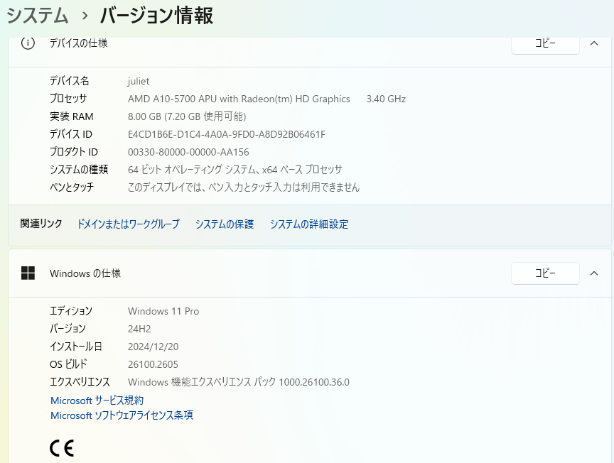

# 2024年12月の Windows 11 インストール要件緩和に関する独自解説

2024年12月にWindows 11 インストール要件の一部が緩和され、関連情報が [**ブログで公開された**](https://techcommunity.microsoft.com/blog/windows-itpro-blog/tpm-2-0-%E2%80%93-a-necessity-for-a-secure-and-future-proof-windows-11/4339066)ので、独自視点で解説します。この記事の内容は事実に基づいていますが、初心者にも理解し易く説明するめ、個人的な考えや推測を含んでいます。Microsoft の見解や方針とは異なる可能性があるので、扱いについてはご注意ください。

インストール要件緩和の内容

2024年12月のWindows 11 インストール要件緩和内容の実体は、「AllowUpgradesWithUnsupportedTPMOrCPU」レジストリ値の設定参照の廃止だけです。

すなわちインストール時にレジストリ値を設定しなくても「AllowUpgradesWithUnsupportedTPMOrCPU」レジストリ値を設定している状態とみなされるため、Windows 11 インストール要件が次の様になります。

１．CPU型版によるWindows 11インストール可否判断が無くなりました

２．搭載しているTPMがTPM 1.2 でも、TPM 2.0 搭載とみなされます

他の要件はこれまで通りです。現在のWindows 11 システム要件は次のURLで参照できます。

[**Windows 11 の仕様、機能、コンピューターの要件を確認する**](https://www.microsoft.com/ja-jp/windows/windows-11-specifications)

[https://www.microsoft.com/ja-jp/windows/windows-11-specifications](https://www.microsoft.com/ja-jp/windows/windows-11-specifications)

従ってシステム要件の、**1 ギガヘルツ (GHz)** 以上で 2 コア以上の [**64 ビット互換プロセッサ（詳細別リスト掲載）**](https://learn.microsoft.com/ja-jp/windows-hardware/design/minimum/windows-processor-requirements)と、TPM バージョン 2.0 が必要な点は以前のまま変わっていません。

補足情報

ご存知無い方のために少し補足解説します。

[**Windows 11 をインストールする方法**](https://support.microsoft.com/ja-jp/windows/windows-11-%E3%82%92%E3%82%A4%E3%83%B3%E3%82%B9%E3%83%88%E3%83%BC%E3%83%AB%E3%81%99%E3%82%8B%E6%96%B9%E6%B3%95-e0edbbfb-cfc5-4011-868b-2ce77ac7c70e)** **のページに11月までは、レジストリ値設定により、CPU要件を満たさないかまたは TPM 1.2 しか搭載していない環境にWindows 11をインストールする方法が記載されていました。[以前のアーカイブページで確認](https://web.archive.org/web/20240902091433/https://support.microsoft.com/ja-jp/windows/windows-11-%E3%82%92%E3%82%A4%E3%83%B3%E3%82%B9%E3%83%88%E3%83%BC%E3%83%AB%E3%81%99%E3%82%8B%E6%96%B9%E6%B3%95-e0edbbfb-cfc5-4011-868b-2ce77ac7c70e)できます。このレジストリ設定により、以前からCPU要件を無視し、あるいは TPM 1.2環境にWindows 11をインストールしたりすることが出来ていました。従ってインストール時のレジストリ値設定を苦にしないユーザーにとっては何も変わっていません。

独自視点解説

ここからが独自視点による解説です。

要件外のプロセッサー

以下のリストに載っていないプロセッサーでのWindows 11の利用は、Microsoftはサポートしません。分かり易く解説すると、「動作保証しないので、何が起きても知らない」「動くかも知れないが何が起きるか分からないので使うな」ということです。例えば Windows 11 プロセッサーリストに無い 第7世代CPU Core i7-7700 プロセッサーの利用は、同様にプロセッサーリストに無い Rapbery Pi シリーズの利用と同様に、サポートされないとして扱われます。

TPM バージョン 1.2

TPM バージョン 1.2 を搭載しているシステムでのWindows 11の利用も、Microsoftはサポートしません。リストに無いプロセッサーと同様に考えることが出来ます。「動作保証しないので、何が起きても知らない」「動くかも知れないが責任持てないので使うな」ということになります。

なお TPM はバージョン1.2と、バージョン2.0 では互換性がありません。TPM バージョン1.2 は、セキュリティ面に問題があるSHA1を搭載する使用されなくなった古い製品ですが、一部の日本国内企業向けPCなどでは積極採用されていたので、もしかすると Windows 11 でサポートはされなくても、インストールできるだけで助かると考えるユーザーがいるかも知れません。

ブログでの記述

これまでが鬼の様に互換性に重視して対応して来た Microsoft が、対応に苦慮した結果の策がこの [**ブログへの記述**](https://techcommunity.microsoft.com/blog/windows-itpro-blog/tpm-2-0-%E2%80%93-a-necessity-for-a-secure-and-future-proof-windows-11/4339066) ではないかと推測します。長くて理解し難い、意味不明なブログ記事となっています。私はこの不具合このブログで言いたいことはおそらく、**決して書いてはありませんが**「TPM 1.2 でもインストールできちゃうけど、危険だから、いい子はみんな使わないでね！」ではないかと推測しています。かつて Windows Vista でTPM バージョン 1.2 に対応し、推奨して来た歴史があるので、使わないで下さいとは言えないのだと思います。

実験結果

「AllowUpgradesWithUnsupportedTPMOrCPU」レジストリ値を設定した場合の、Windows 11インストール時の挙動は何回も確認していますが、念のため動作確認しました。手順は Windows 11 のダウンロード のページからダウンロードして USB フラッシュメモリーに作成した Windows 11 インストールメディアで起動して、空のSSDドライブに新規インストールしました。Windows インストール前に入念にBIOS更新とTPM装着とTPM 有効化、UEFIブートとCSM無効を確認しましたが、実体はデフォルト設定のままでした。インストールはスムーズに Microsoft アカウントの登録まで進み、全く問題はありませんでした。次の環境で動作確認しました。

実験環境

マザーボード：[Gigabyte GA-F2A85XM-D3H (rev. 1.0)](https://www.gigabyte.com/jp/Motherboard/GA-F2A85XM-D3H-rev-10#ov)

BIOS： [バージョン F4g (Aug 06, 2024)](https://www.gigabyte.com/jp/Motherboard/GA-F2A85XM-D3H-rev-10/support#support-dl-bios)

TPM： 仕様バージョン 1.2 IFX製

CPU：AMD A10-5700 APU with Radeon(tm) HD Graphics 3.40 GHz

OS： Windows 11 Pro 24H2 (OS ビルド 26100.2605)

考察

この実験では2点、注目すべき点を発見しました。

１．Windows 11 インストーラーの構成が大幅に更新されていました

２．12年前製造のマザーボードのUEFI BIOSが、10年ぶりに更新、公開されていました

前者は約20年前から噂されて来た、知る人ぞ知る Windows NT系インストーラーの念願の改訂です。後者は勝手な個人的推測ですが、「TPM 1.2, TPM 2.0 搭載可能なマザーボードについては、Windows 11が容易にインストール可能になるから準備しておく様に」と事前にハードウェアメーカーに連絡があったのではないかと思います。逆にこのBIOS更新が5か月前に準備されていたということは、これ以上のWindows 11 インストール要件緩和は無いと推測します。

最後にご注意

この記事は先日起きた、Windows 11 インストール要件の一部緩和について、独自視点で解説しただけです。決して Windows 11 のシステム要件を満たさないハードウェア環境での利用やインストールを推奨している訳ではありません。その様な環境での Windows 11 の利用は推奨されないだけではなく、トラブルが発生する可能性があります。十分ご理解をお願いします。またこの記事内容は個人的な推測を含み、Microsoftの公式見解ではありませんので、一部だけを切り取って流布させたりしない様、扱いについてもご注意をお願いします。

参考動画）

[https://www.youtube.com/watch?v=qKhBPcDG37g&t=3s](https://www.youtube.com/watch?v=qKhBPcDG37g&t=468s)
