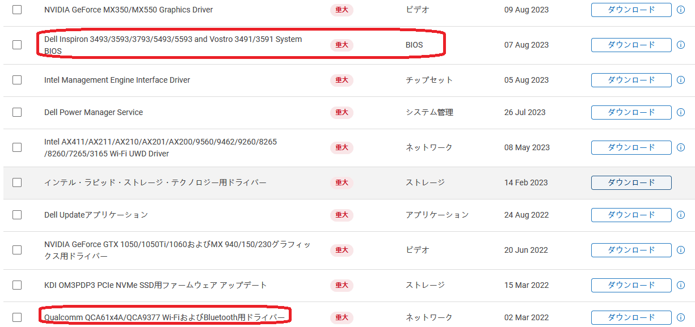

# Bluetooth や Wi-Fi の問題を自己解決する手順

最近増えている Bluetooth や Wi-Fi の問題を自己解決する方法を示します。

本題の前にまず、**8月26日頃に発生していた Bluetooth の ON/OFF ボタンが無くなって使えなくなる問題は、8月27日の新しいWindows Update の実行とペアリングのし直しで復旧する**との情報を、[孝子 赤松](https://answers.microsoft.com/ja-jp/profile/375ed958-a7e5-49a4-bcd2-c3b14ac87d85) さん から頂きましたので、共有します。心当たりの方はまず、試してみて下さい。赤松さん、ありがとうございます。

以下は前述の手段でも治らない、Bluetooth だけではなく、Wi-Fi のトラブルでも有効な自己解決方法です。

今では当たり前の様にノートPCに搭載されている Bluetooth や Wi-Fi 等の無線システムには次の特徴があります。

① プロトコルや通信方式、コントローラチップが年々進化するため、関連のファームウェアとドライバーの更新頻度が多い

② USBタイプアダプターの価格を見ても分かるように安価なハードウェアで実現

③ 実際の運用時は故障が結構あり、特に3年以上使用すると故障が増える傾向

このうち ① が原因のトラブルは、利用者個人で対応可能ですが、以外と知られていません。基本的な対処方法は、以下を順に確認、実行することです。ときどきここの質問で**「ドライバーは最新にしてあるから大丈夫です」という人がいますが、間違っています。「PC側のファームウェア」を最新にすることが重要です。**

**１．PCメーカーのその機種用サポートページでの注意事項を良く確認して対処**

**２．PCメーカーのその機種用サポートページから診断ツール、Bluetooth または Wi-Fi 用ファームウェアを含む各種ファームウェアの最新版、ドライバー、BIOSをダウンロードしてインストール**

**３．BIOSを起動して、Bluetooth または Wi-Fi 機能が有効なことを確認**

**４．Windows UpdateとデバイスマネージャーでBluetooth または Wi-Fi ドライバーの正常インストールの確認**

4年前のWindows 10用機種の Dell Inspiron 3793 のBluetoothを例に、実際に見て行きましょう。

注意事項の確認

まず検索エンジンで「Inspiron 3793」で検索すると**一発で以下のページが出ます。**

[https://www.dell.com/support/manuals/ja-jp/inspiron-17-3793-laptop/inspiron-3793-setup-and-specifications/inspiron-3793%E3%81%AE%E3%82%BB%E3%83%83%E3%83%88-%E3%82%A2%E3%83%83%E3%83%97?guid=guid-3d8e73c7-0851-4493-89c6-9542e90af43e&lang=ja-jp](https://www.dell.com/support/manuals/ja-jp/inspiron-17-3793-laptop/inspiron-3793-setup-and-specifications/inspiron-3793%E3%81%AE%E3%82%BB%E3%83%83%E3%83%88-%E3%82%A2%E3%83%83%E3%83%97?guid=guid-3d8e73c7-0851-4493-89c6-9542e90af43e&lang=ja-jp)

**Dell Update** には、サポート技術情報記事 [SLN305843](https://www.dell.com/support/article/sln305843/) の Dell Update の最新情報が更新された情報があるので、確認しておいた方が良いでしょう。

メーカー製ファームウェア類

次に「Inspiron 3793 サポート」で検索すると**一発で以下のページが出ます。**

Inspiron 3793のサポート | ドライバーおよびダウンロード

[https://www.dell.com/support/home/ja-jp/product-support/product/inspiron-17-3793-laptop/drivers](https://www.dell.com/support/home/ja-jp/product-support/product/inspiron-17-3793-laptop/drivers)

Dell の場合はツールがあり、該当機種であれば「アップデートの自動的に検索 / アップデートのチェック」で自動検索も可能ですが、非Dell PCでも以下の様に該当機種のダウンロード情報を得ることが出来ます。次の通り「**重大**」が沢山ありますね。**Bluetooth もありますし、BIOSは2023年8月7日に最新版が公開されています。**メーカは発売後結構な年数、サポートソフトを供給し続けている事が多いです。4年程度では当然のことです。

.

**Bluetooth や Wi-Fi を使用する上でファームウェアの更新は「各デバイスが提供する機能そのものの更新」です。Windows Update やスマホのアプリの更新等と同様に比較的簡単に、自分自身で対応出来るので、試してはいかがでしょう。**

参考）

[ファームウェア更新の重要性になかなか気付かない質問](https://answers.microsoft.com/ja-jp/windows/forum/all/wifi%E3%81%AE%E3%83%AF%E3%82%A4%E3%83%A4%E3%83%AC/947e9d80-7b59-49aa-b58d-ef3af4a159d6)

追記）

この様な情報記事を公開しましたが、去年（2024年）に Windows 11 非対応 CPU 搭載の DELL XPS 15（2016年製 Windows 11 非対応CPU）に強制的に Windows 11をインストールした時に、PC 内蔵 Bluetooth ホストアダプターが正常動作しなくなりました。一部のマウスしかペアリング出来ず、他の Bluetooth デバイスは検知しません。またペアリングしたマウスも正常動作しません。念のため、DELL 公開のBIOSやファームウェアは勿論、互換性がありそうなドライバーやファームウェアを探しましたが、購入後8年目なので潮時と思い、あきらめました。そして最新の Bluetooth 5.4 USB ホストアダプターを 1,266円（ノーブランド、税込み、送料無料）を調達して使っています。
