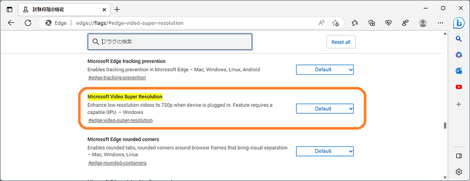

# Microsoft Edge Insider Canary Channel（Bing Chatは昨日からGPT-4）

先日たまたま、ここの[質問「エッジのツールの一つである、「HDモード」について」](https://answers.microsoft.com/ja-jp/microsoftedge/forum/all/%e3%82%a8%e3%83%83%e3%82%b8%e3%81%ae%e3%83%84/06c652f7-98d3-4b01-b610-d46d52149783)を調べているうちに、Microsoft Edge Insider Canary Channel 版 というものがあり、VSR (Video super resolution) 機能など、いくつかの最新の機能が利用出来る様になっていたので、簡単に紹介します。

[Microsoft Edge Insider Canary Channel (English Version)](https://www.microsoftedgeinsider.com/en-us/download/canary)

Microsoft Edge では以前から、ベータ版等が [Windows 11](https://answers.microsoft.com/ja-jp/insider/forum/all/windows-11-insider-canary/d000e6bd-314c-4ee8-9d7b-5f4ed3bf36fb) や Visual Studio などと同様にリリース前の事前確認（Preview）用として、誰でもダウンロードしてお試し利用出来る様に配布されていました。確認すると [2022年12月には、試験的な内容 を配布する「 Canary Channel」が、Microsoft Edge Insider には設けられていた様子です。](https://learn.microsoft.com/ja-jp/deployedge/microsoft-edge-channels?WT.mc_id=WDIT-MVP-35878)

※Canary とはカナリア（鳥）のことです。昔炭鉱作業で、歌が上手いからでは無く、いち早く生命に関わる空気や換気の異常を検知するため、カナリアが利用されたことに由来する表現と推測します。危険に気を付ける必要があるという事になります。

ダウンロード

Windows 10またはWindows 11を使用していれば、Canary 版 Microsoft Edge は容易に入手出来ます。

[Microsoft Edge Canary チャネル](https://www.microsoftedgeinsider.com/ja-jp/download/canary) のページからダウンロードしてインストールすることで、直ぐに使えます。

[https://www.microsoftedgeinsider.com/ja-jp/download/canary](https://www.microsoftedgeinsider.com/ja-jp/download/canary)

他の Betaチャネル、Devチャネル についても [Edge Insider のダウンロードページ](https://www.microsoftedgeinsider.com/ja-jp/download/)で入手可能です。

[https://www.microsoftedgeinsider.com/ja-jp/download/](https://www.microsoftedgeinsider.com/ja-jp/download/)

**これらInsider版は事前評価版ですので、不具合が発生する場合があります。そしてフィードバックが求められています。是非 **[**https://aka.ms/MSEdgeTopFeedback**](https://aka.ms/MSEdgeTopFeedback)** からフィードバックをお願いします**。

Video Super Resolution

Canary 版今回リリースの目玉の、VSR (Video Super Resolutuon) について紹介します。VSR機能を使用するには、操作PC自体が、**NVIDIA RTX 20/30/40シリーズまたはAMD RX5700～RX7800シリーズのGPUを搭載**している必要があります。なおかつ再生動画の解像度が720p未満で、映像の縦横が192ピクセル以上の制約です。

参考）

[窓の杜：AIでビデオを鮮明に ～「Microsoft Edge」に「超解像度ビデオ」機能が導入へ](https://forest.watch.impress.co.jp/docs/news/1483594.html)

[- Canaryチャネルの半数に提供中 -](https://forest.watch.impress.co.jp/docs/news/1483594.html)

[https://forest.watch.impress.co.jp/docs/news/1483594.html](https://forest.watch.impress.co.jp/docs/news/1483594.html)

（わかり易いMicrosoftの日本語解説が無いため、窓の杜を参照）

実際にYouTubeなどで試したところ、動画の一覧ページに移動すると、アドレス入力バー横に、青い「HD」マークが表示されることを確認しました。

ここでこの**「HD」ボタンを押すと有効 **になり、常時VSRモードで動画再生となります。しかし正直言って、VSR 機能による高精細化の有効性をよく確認出来る動画は見つかりませんでした。Edge VSR 用のサンプルはありましたが、それほどまでの有効性は理解出来ませんでした。一方で動画検索をしているうちに、GoogleとNVIDIAからもAI補完機能による、同様な古い低解像度画像を高解像度化するサービスが提供されているという事を知りました。

それから Canaryチャネルの「Edge 112」以降を利用しているにも関わらず、VSRが有効になっていない場合、以下の設定で試験機能を有効化出来るとのことでしたが、これは対象GPUを搭載していない環境では、効果がないことを確認しました。現時点では高性能GPU搭載が必須の機能です。

余談ですが、試した限りではいくつか一般的な高精細、高画質の静止画のページに移動しても「HD」ボタンは表示されませんでした。推測ですが、ここの[質問「エッジのツールの一つである、「HDモード」について」](https://answers.microsoft.com/ja-jp/microsoftedge/forum/all/%e3%82%a8%e3%83%83%e3%82%b8%e3%81%ae%e3%83%84/06c652f7-98d3-4b01-b610-d46d52149783)をされた方のページが特殊なのか、またはEdgeの誤認識や誤動作かも知れません。

Bing Chat

Canary Channel 版でも Bing Chatが使えるかの確認をするついでに、GPT-4について聞きました。勿論利用可能です。そして**文書制限が15に拡大**し、何とすでに **昨日から、GPT-4になっている**との事でした。

