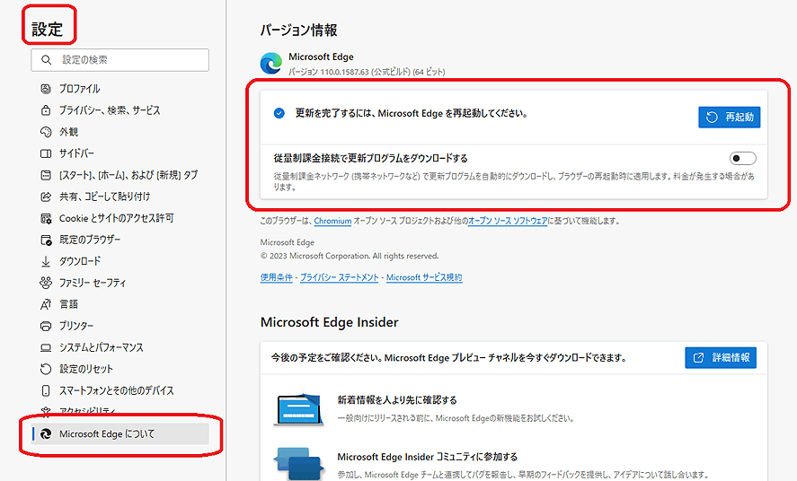

# Microsoft Edge を更新しましょう

ここ最近、やたらとMicrosoft Edgeの更新が増えて、またその関係と思われる質問が増えています。

通常は自動的に更新されるはずですが、自分で確認して、手作業で更新することも可能なので、その方法です。**最近、動きがおかしいとか不安定な方は、確認をお勧めします。**

Edge右上の3点ドットをクリック、メニューの下方にある設定を開き、Microsoft Edgeについてをクリック。

一番上の「バージョン情報」の辺りに、更新があるか、最新であるかが表示されます。

