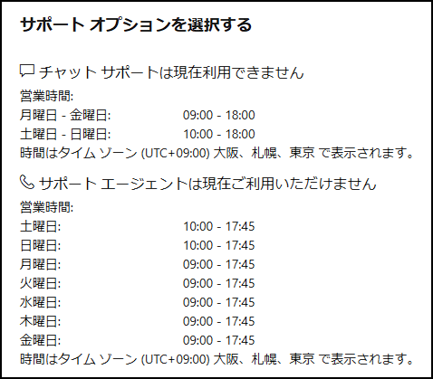

# Microsoft の電話サポートについて

Microsoft 製品の利用者は、一定の範囲でサポート窓口を無償で利用できますが、サポートの手段はサポート対象の製品とそのライセンスによって異なります。

いずれの場合も、サポート対象の正規製品・正規ライセンスを保有していることがサポートを受ける条件です。

- **無償電話サポートの範囲**

- Microsoft 365 サブスクリプション(*1) の保有者：  
Microsoft 365 (Office) と Windows のサポート（インストール・ライセンス認証・テクニカルサポート）
- それ以外：  
Office アプリケーションと Windows OS の、インストールとライセンス認証のサポート  
※OEM 版（プリインストール版）・DSP 版の Windows はサポート対象外です。  
　OEM 版は PC メーカーのサポート、DSP 版は購入した販売店のサポートを利用してください。
- **無償電話サポートの範囲外**

- 買い切り Office 製品（プリインストール版を含む）のテクニカルサポート  
（チャット サポートが受けられます）
- Microsoft 365 サブスクリプション* の保有者以外への Windows のテクニカルサポート  
（チャット サポートが受けられます）  
※OEM 版（プリインストール版）・DSP 版の Windows はサポート対象外です。  
　OEM 版は PC メーカーのサポート、DSP 版は購入した販売店のサポートを利用してください。
- 電話サポートが提供されていない製品のサポート（Outlook.com / OneDrive）  
（アプリ内からチャットまたはメールでサポートが受けられます）
- **無償電話サポートを含めてサポートが提供されていない製品**

- サポートが終了した製品(*2)

電話サポートはすべてコールバック（Microsoft からの折り返し電話）です。**直接電話を掛けてもサポートは受けられません**。

[お問い合わせ - Microsoft サポート](https://support.microsoft.com/contactus)（https://support.microsoft.com/contactus）から電話サポートを依頼してください。

なお現在のサポート窓口の営業時間は以下のとおりです。時間外は以下の画面が表示されて、チャットや電話の申し込みはできません。

※祝日と年末年始もサポートは休業です

※電話サポートの選択肢が表示されない場合は、電話サポートの営業時間外か、または電話サポートが提供されていない製品のサポートを依頼している可能性があります。

サポート対応中に電話やチャットが切れてしまった場合は、再度サポート依頼をして、サポート番号を伝えてください。

※フォーラムに継続依頼を投稿されても対応できません。

*1 無償サポートが含まれるMicrosoft 365 サブスクリプション

- Microsoft 365 Basic
- Microsoft 365 Personal
- Microsoft 365 Family
- Microsoft Copilot Pro

※法人向け Microsoft 365 サブスクリプションのサポートは別窓口です。以下を参照してください。

- 一般法人向け Microsoft 365 サポート窓口のご紹介 - Microsoft コミュニティ  
[https://answers.microsoft.com/ja-jp/msoffice/forum/all/201925-%E6%9B%B4%E6%96%B0/7635019b-2939-4ca3-a1f1-6cf8c249c58e](https://answers.microsoft.com/ja-jp/msoffice/forum/all/201925-%E6%9B%B4%E6%96%B0/7635019b-2939-4ca3-a1f1-6cf8c249c58e)
- サポートを受ける - Microsoft 365 admin | Microsoft Learn  
[https://learn.microsoft.com/ja-jp/microsoft-365/admin/get-help-support?view=o365-worldwide](https://learn.microsoft.com/ja-jp/microsoft-365/admin/get-help-support?view=o365-worldwide)  
※ CSP から Microsoft 365 を購入している場合は、購入した CSP のサポート窓口に相談してください。

*2 サポートが終了した製品

- Windows 版 Office 2013 以前、Mac 版 Office 2019 以前
- Windows 10 22H2 以前、Windows 11 22H2 以前

Microsoft のサポート窓口に連絡する方法については、以下の記事を参照してください。

- マイクロソフト サポートの利用方法 (ホームユーザー向け)  
[https://sway.office.com/jGpeHioJ7jGSGzZH](https://sway.office.com/jGpeHioJ7jGSGzZH)

Outlook.com と OneDrive のサポートを受ける方法は、以下の記事を参照してください。

- [Outlook.com のサポートを受ける方法 - Microsoft サポート](https://support.microsoft.com/ja-jp/office/outlook-com-%E3%81%AE%E3%82%B5%E3%83%9D%E3%83%BC%E3%83%88%E3%82%92%E5%8F%97%E3%81%91%E3%82%8B%E6%96%B9%E6%B3%95-f5482a98-616c-4d44-b7c5-8aaaadf5c11a)
- [OneDrive サポートへの問い合わせ方法 - Microsoft コミュニティ](https://answers.microsoft.com/ja-jp/windows/forum/all/onedrive/616e212b-4c4e-4c8b-ba99-448636e9f9ab)

サポート範囲についてより詳しくは、以下の記事を参照してください。

- Microsoft 365 カスタマー サービスとサポート - Microsoft サポート  
[https://support.microsoft.com/ja-jp/office/microsoft-365-%E3%82%AB%E3%82%B9%E3%82%BF%E3%83%9E%E3%83%BC-%E3%82%B5%E3%83%BC%E3%83%93%E3%82%B9%E3%81%A8%E3%82%B5%E3%83%9D%E3%83%BC%E3%83%88-96162163-b3aa-498b-bbbb-5e757b0f31da](https://support.microsoft.com/ja-jp/office/microsoft-365-%E3%82%AB%E3%82%B9%E3%82%BF%E3%83%9E%E3%83%BC-%E3%82%B5%E3%83%BC%E3%83%93%E3%82%B9%E3%81%A8%E3%82%B5%E3%83%9D%E3%83%BC%E3%83%88-96162163-b3aa-498b-bbbb-5e757b0f31da)
