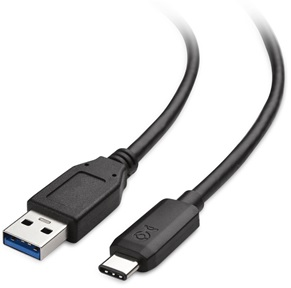
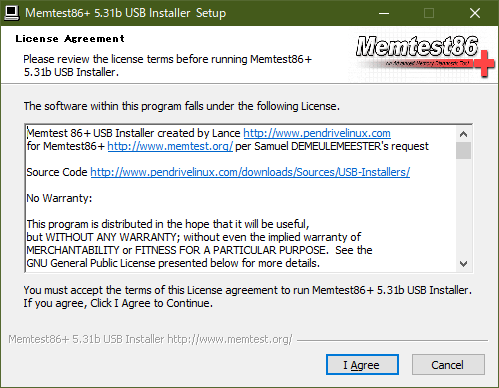
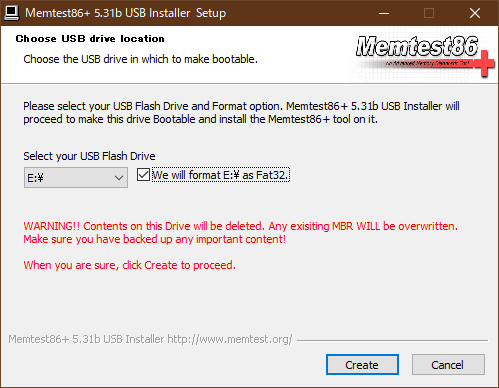
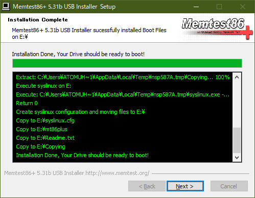
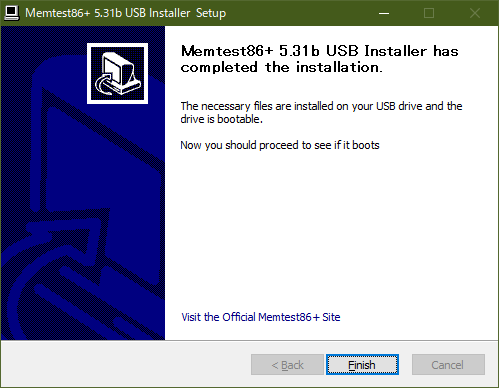
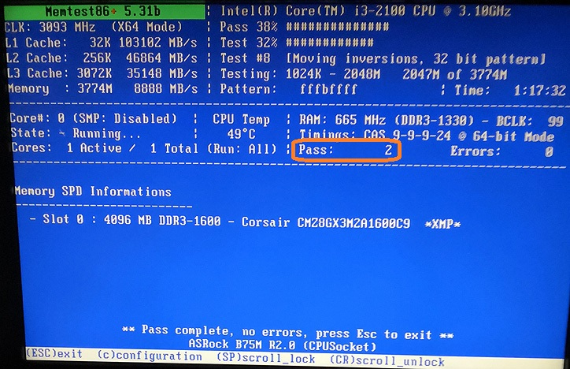
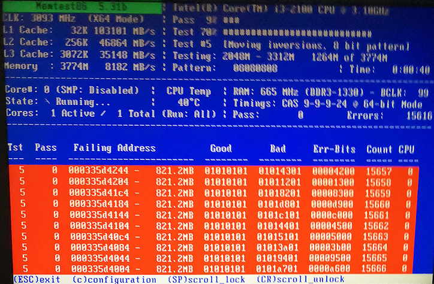

# PC ハードウェアの正常性検証（Part 1）設置・運用・環境とメモリ

概要

Microsoft コミュニティの質問を見ていると、PC ハードウェアの異常に起因するエラーに関する質問が結構あります。通常、市販のPCのハードウェアはそれほど故障するものではありません。しかしながら運悪く、ごくまれに故障してしまうことがあるのも事実です。

Windows の不具合は、システムファイル異常やドライブのファイルシステム不整合といったソフト的な問題が原因の場合もありますが、まずはハードウェアの正常動作を確認した上で問題の原因を見極めて対策するのが定石です。しかし残念ながら Microsoft DOCsの[「Windows クライアントのトラブルシューティング」のページ](https://docs.microsoft.com/ja-jp/troubleshoot/windows-client/welcome-windows-client?WT.mc_id=WDIT-MVP-35878) には、個別ハードウェアの正常性を検証する手順までは載っていません。

そこでWindows PCを正常動作させるために行うべき、ハードウェアの正常性検証の手順を Part 1 と [Part 2](https://answers.microsoft.com/ja-jp/windows/forum/all/pc/cb9cd87c-2745-45c5-9e6a-bfd8f6567898) に分けて、項目別にまとめてみました。[Windows PC ハードウェア](https://developer.microsoft.com/ja-jp/windows/hardware/?WT.mc_id=WDIT-MVP-35878)の問題解決の参考にして下さい。

通常発生するPCハードウェアの不具合は、主に次の４点に絞られます。

1. 設置・運用・環境
2. メモリ
3. [ディスクドライブ](https://answers.microsoft.com/ja-jp/windows/forum/all/pc/cb9cd87c-2745-45c5-9e6a-bfd8f6567898)
4. [電源ユニット](https://answers.microsoft.com/ja-jp/windows/forum/all/pc/cb9cd87c-2745-45c5-9e6a-bfd8f6567898)

設置・運用・環境

設置・運用・環境の問題は、トラブル発生時に最初に確認するべき事項です。ケーブル、コネクター、ソケット、ルーター、スイッチングハブ、外部電源異常といったPC本体以外の運用上の不具合が、この問題の多くの原因です。

最近のPCや周辺機器は非常に信頼性が高くなっています。しかしごくまれに故障している場合があります。一般に初期不良と呼ぶ、部品の早期異常が原因の場合もあるため、機器が新しいか古いかには関係なく故障は発生します。とは言ってもこれら設置・運用・環境に関する多くの問題の原因は、人為的なものによります。例えば、PCのコネクターやケーブルを正しく装着できない人は多いですし、電源ケーブルのコネクタを奥までしっかりと挿さない事例もあります。モニター・キーボード・マウス以外にご自身で追加・交換した部品は確実に正しく動作しているのでしょうか。特に **SSD** や **HDD** の追加・換装、**カメラ**、**ビデオ** 系の周辺機器には注意が必要です。

この項のハードウェア・チェックポイントは次の様に比較的簡単です。

- PCの基本動作に不要な周辺機器を、一旦全て外して動作確認をします。
- 全てのソケットとコネクターの正しい、しっかりとした接続を確認します。
- 特定の周辺機器や通信動作が異常の場合は、ケーブルを交換して試してみることも有効です。  

メモリ

一見正しく動作している様に見えるPCでも、実はメモリ異常があることは意外と多くあります。最初のうちは正常動作していても、使っているうちに動作不良や相性問題が発生する場合もあります。SIMMと呼ぶメモリモジュールは簡単に入手・交換・増設できて便利ですが、正常動作する接続先を選んでしまう**相性問題**がある場合があります。サーバー用マシン以外の多くのPCハードウェアは、動作中にメモリの正常性検証をしないため、メモリ異常に起因する不具合が発生しても分かり難くなっています。

メモリの検査は、**Windows 管理ツール**として付属している **Windows メモリ診断** を使用して行うことが出来ますが、実はあまり精度が良くありません。高負荷時や特定パターンでのメモリアクセス エラーを見逃す場合があります。そこでここでは**「Memtest86+」**というソフトウェアツールを使って検査する方法を示します。以下に手順を説明します。

準備とMemtest86+のダウンロード

1. まず Windows PCと、初期化しても良いUSB メモリ（1MB以上の容量）を用意します。
2. 次に [**http://memtest.org/**](http://memtest.org/) をブラウザで開き、[**Download (Pre-build & ISOs)**](http://memtest.org/#downiso) をクリックします。
3. **Download - Auto-installer for USB Key (Win 7/8/10)** をクリックして zip ファイルをダウンロードします。

Memtest86+のインストール

1. 入手した **memtest86+-5.01.usb.installer.zip**（ファイル名はバージョンよって変わる）を右クリック後「すべて展開」を選択して展開します。
2. 用意したUSBメモリーを装着後、展開して作成された **Memtest86+ USB Installer.exe** を実行し、ユーザーアカウント制御を確認してインストールを開始します。
3. **I Agree** をクリックしてライセンス確認します。  

4. 書き込み先のUSBドライブを選択して、**We will format** にチェック後** Create **をクリックします。USBメモリーへの書き込みが始まります。  

5. Installation Complete 画面で **Next** をクリック後、次画面で **Finish** で完了です。  

Memtest86+の起動

書き込みが終わったUSBメモリを使用して、テスト対象のPCを起動します。USBメモリを装着してPCの電源を入れ直すだけで起動する場合もありますが、環境によっては UEFI/BIOS の設定変更や、電源ON時に「F1」等の特殊キー押下により一時的にブートデバイスを USB Flash に変更する操作が必要です。

Windows 11対応の**UEFI BIOSでは、一時的にセキュアブートを無効にして、CSM を有効にしてテストを実行し、テスト後は元の設定にもどします。**

メモリテストは自動的に起動して進みます。環境にもよりますが、一連のテストが終了するまで **2～3時間程度** かかります。途中で終了する場合は、**ESCキー**を押します。次に示す様に **Pass:** のサイクルが **2回**以上 になったらば、そのPCのメモリ環境はほぼ問題無いと考えて良いです。

メモリ環境に異常がある場合は、次の様に画面上に赤い背景でエラーが報告されます。

メモリのテストツールは、前述の **Windows メモリ診断** を始め  **Memtest86+ **以外にも同種のMemtest系ツールなどをはじめ、いくつかあります。しかしこの **Memtest86+** は最新のテスト内容と環境向けに結構な頻度で更新されていて、同じ環境で試したときには他のツールよりもより早く、より厳しく問題を発見することを確認しています。ですので知っておいて損は無いツールです。

今回は、PC ハードウェアの正常性検証の前編として、まず基本的な設置・運用・環境の確認と Memtest86+ によるメモリテスト手順を示しました。[**Part 2に続きます。**](https://answers.microsoft.com/ja-jp/windows/forum/all/pc/cb9cd87c-2745-45c5-9e6a-bfd8f6567898)

[**English Version**](https://answers.microsoft.com/en-us/windows/forum/all/pc-hardware-health-verification-part1/3a019498-54c5-441f-b0c1-a14cdb6fd899)
