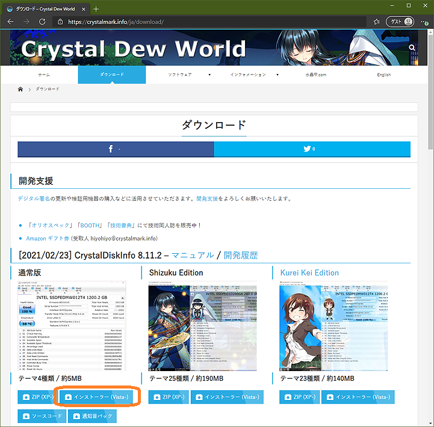
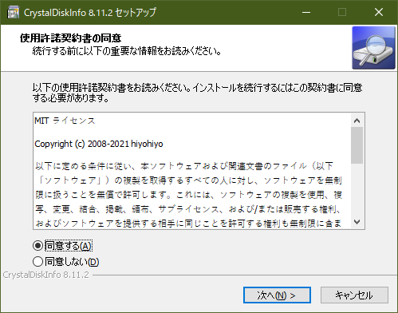
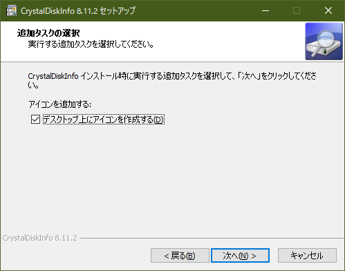
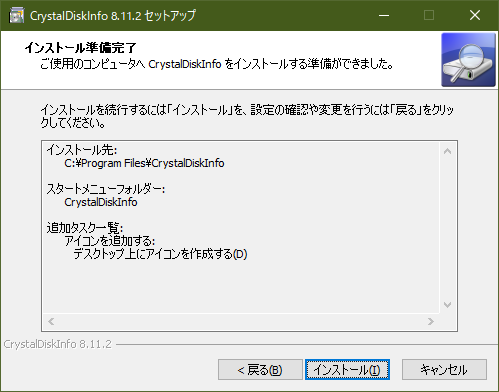
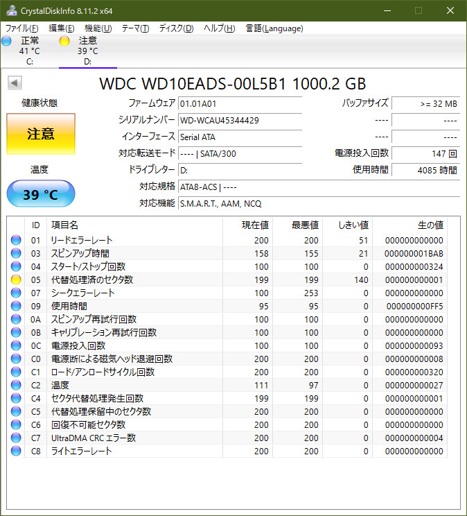

# PC ハードウェアの正常性検証（Part 2）ディスクドライブ・電源とまとめ

はじめに

この記事は、[PC ハードウェアの正常性検証（Part 1）設置・運用・環境とメモリ](https://answers.microsoft.com/ja-jp/windows/forum/windows_10-hardware/pc/b19a6727-b90a-4a42-b61f-930132b8d31c) の続きです。次の4点の通常発生するPCハードウェアの不具合のうち、ディスクドライブと電源ユニットの検証方法について示します。

1. 設置・運用・環境
2. メモリ
3. ディスクドライブ
4. 電源ユニット

[設置・運用・環境とメモリの検証](https://answers.microsoft.com/ja-jp/windows/forum/windows_10-hardware/pc/b19a6727-b90a-4a42-b61f-930132b8d31c)については、[Part 1](https://answers.microsoft.com/ja-jp/windows/forum/windows_10-hardware/pc/b19a6727-b90a-4a42-b61f-930132b8d31c) を参照してください。

ディスクドライブ

現在のディスクドライブ(SSD/HDD)は、それ自体が小さなコンピューターです。ドライブのRead/Writeには記録メディア（磁性体やフラッシュメモリ）のエラーがつきものです。ドライブでは記録データを保全しながらメディアの寿命を伸ばすため、エラー訂正、状況に応じたリトライ、バッドブロックと呼ぶ不良なメディア部分を記録して避ける仕組みが動作しています。そしてドライブの不具合のほとんどが、このバッドブロックの発生や管理の不具合に起因しています。

各ドライブはコンピューターですから、特殊な管理領域に過去の自分自身の動作やエラーの記録を持ち、保全しています。SMART (S.M.A.R.T. Self-Monitoring, Analysis and Reporting Technology)と呼ぶ、この管理情報を参照することで、現在のドライブの状態や過去のエラー履歴を確認することができます。例えばCrystalDiskInfoというWindows上で動作するツールを利用することで、容易にこの各ドライブの状態や健全性、SSDの寿命を確認することができます。

Windows 上で SMART を確認するツールはいくつかあります。ここでは使い易く、結構な頻度で最新の状況に合わせた更新が行われている **CrystalDiskInfo** について説明します。

CrystalDiskInfoのダウンロード

様々なサイトで入手可能ですが、ここでは[ツールの開発者である ひよひよ氏](https://crystalmark.info/ja/information/profile/) が運営する [本家のダウンロードページ](https://crystalmark.info/ja/download/)からの入手について説明します。

通常は次の[CrystalDiskInfoのダウンロードページ](https://crystalmark.info/ja/download/)にアクセスして、[インストーラー (Vista-)](https://crystalmark.info/redirect.php?product=CrystalDiskInfoInstaller) をクリックしてダウンロードすることをお勧めします。

**CrystalDiskInfoの入手ページ： **[**https://crystalmark.info/ja/download/**](https://crystalmark.info/ja/download/)

CrystalDiskInfoのインストール

入手した CrystalDiskInfo8_11_2.exe（数字はバージョンによって異なる）をクリック後、ユーザーアカウント制御を確認してインストールを開始します。最初はライセンスの確認画面です。**次へ** をクリックして進みます。

デスクトップアイコン作成の確認画面です。**次へ** をクリックして進みます。

インストール開始の確認画面です。**次へ** をクリックして進みます。

インストール完了後は起動確認画面が表示されます。**CrystalDiskInfo を実行する** をチェックしたまま **完了** をクリックすると、ユーザーアカウント制御の確認後に起動します。

起動と検査

以下に起動後の画面例を示します。基本的には見るだけのツールなので、ドライブ選択以外の操作は特に必要ありません。

現在表示しているドライブに全く問題が無い場合は、この様に水色の背景で**正常**と表示されます。

以下は、代替セクター（バッドブロックの置き換え）が発生しているHDDの状態画面です。健康状態が**注意**となり、黄色のアイコンで表示されます。もし代替処理保留中のセクタ数がゼロではない場合には、今後**データの損失の可能性**があるため注意が必要です。ドライブが不良な場合やメディアが高温の場合には、**赤色アイコン**で異常を伝えます。各ドライブの表示項目と意味は、そのドライブが持つ SMART 機能に依存しています。

代替処理保留中のセクタがある場合、該当ドライブの交換が最良の対策の１つです。他の方策としては、問題があるドライブのデータをバックアップした上で、物理フォーマットやスキャンツールを使用したドライブ・スキャン等をして、保留中のセクターをゼロにする方法があります。

  
この様に **CrystalDiskInfo** は入手、インストール、実行も簡単で、最新のSMARTにも対応しているツールなので、Windowsを使い始めるときには入れておくと良いでしょう。

電源ユニット

ケーブル類や環境も正しい、メモリー、ディスクも異常が無いといった場合には、電源ユニットが問題の可能性があります。電源ユニットの異常は一般的に「電源が入らない」「運用中に突然電源が切れる」「異音がする」「異臭がする」といった症状があるため、分かり易いです。また電源ユニットは経年劣化があるコンデンサーが多数使われていることから、5年や10年の使用期間で考えた場合には、一種の消耗品であるとも言えます。

厄介なのは、正常動作している様に思えても、電源ユニットの不良や容量不足が原因の問題が発生している場合があることです。デスクトップPCでは、グラフィックボードを追加・交換する場合がありますが、電源容量が足りているでしょうか？バスパワーUSBデバイスの中には結構な電力を消費するデバイスがあります。その様なデバイスがシステム全体の正常運用に悪影響をしている場合もあります。

前述の様に電源ユニットは実質消耗品のため、一見正常動作している様に見えても、経年劣化して本来の性能（出力）が出ていない場合があります。最初のうちは正常動作していても、コンデンサー等の内部部品が劣化して、4年5年と経つうちに不具合の原因となることがあります。

デスクトップ型自作パソコンであれば、別の電源ユニットに交換して試すのことが、手っ取り早い電源ユニット不良の問題解決方法です。ワットチェッカー等を使用して、消費電力が予定の範囲内か確認する方法もあります。少し手間ですが、負荷運用中にテスターを使用して、電源の5Vと12Vが正しく出力されているか確認する方法もあります。さらに、やや高価ですがUPS（無停電電源装置）を導入することで、不安定供給電源の環境でも安定動作させたり、電源の根本原因の究明に役立つ場合があります。

環境要因も確認済、メモリやディスクが正常なのに何かおかしい場合、電源不良は疑ってみるべき項目です。

まとめ

Windowsの調子が悪いときにWindowsの不具合を疑って、やみくもに初期化やクリーンアップを実行する前に、次のチェックをしてみましょう。

- 設置・運用・環境（コネクター、ケーブル類、追加変更した周辺機器の確認）
- メモリー（Memtest86+）
- ディスクドライブ（CrystalDiskInfo）
- 電源の検証または交換

特にディスク異常が疑われる場合は、これらが正常であることをまず確認してから、次の様なソフト的な不具合を疑ってみます。

- [**CHKDSK C: /r の実行**](https://social.technet.microsoft.com/Forums/ja-JP/fcbe1747-6ee0-4614-bd53-b0bd94753efc/chkdsk-12398212052031612395123881235612390) [ファイルシステムのエラー（chkdskコマンドによる論理エラー確認と修復）](https://docs.microsoft.com/ja-jp/windows-server/administration/windows-commands/chkdsk?WT.mc_id=WDIT-MVP-35878)
- [**システムファイルチェッカー の実行**](https://support.microsoft.com/ja-jp/windows/windows-%E3%81%A7%E3%81%AE%E3%82%B7%E3%82%B9%E3%83%86%E3%83%A0-%E3%83%95%E3%82%A1%E3%82%A4%E3%83%AB-%E3%83%81%E3%82%A7%E3%83%83%E3%82%AB%E3%83%BC%E3%81%AE%E4%BD%BF%E7%94%A8-365e0031-36b1-6031-f804-8fd86e0ef4ca) （[システムファイルのチェック（sfcコマンドによるシステムの整合性確認と修復）](https://docs.microsoft.com/ja-jp/windows-server/administration/windows-commands/sfc?WT.mc_id=WDIT-MVP-35878)）

さらに強力かつ最終的な解決策としては、**Windowsの再インストール** があります。正常なハードウェアで、再インストールしても動作しないWindowsはありません。Windows 10 のインストールはそれほど時間がかかるものでは無いので、状況によっては試す価値があります。

Windows PC の不調には必ず何らかの理由があります。不調な時や何かがおかしい時は、我慢してそのまま使うのではなく、まずはハードウェアの正常性検証ツールを使用して、状態を確認してみることをお勧めします。
