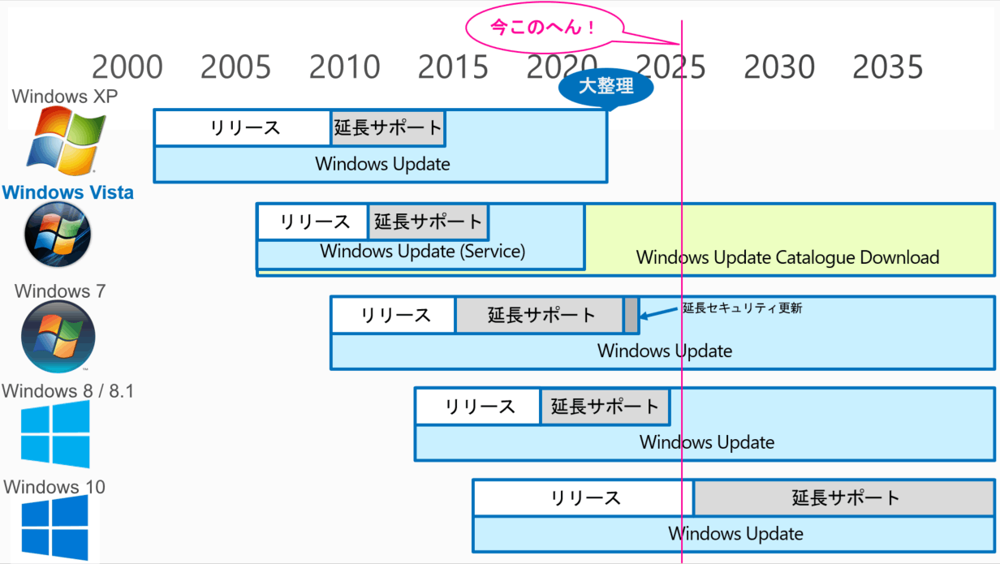

# Windows 10サポート終了とは

Windows 10 サポート終了とは、いったい何が終了するのか皆さん理解していますか？

私はサポート終了でも Windows Update が止まらないという事はよく知っていましたが、詳細には確認していなかったので、これまでの Windows で起きて来たことを調べてみました。主要 Windows の状況は下記の通りです。

.

Windows もバージョン毎に少しずつ変化して来ていますが、これらをまとめると次の5種類の終了があります。  
  
1. リリース期間（サポート期間）が終了  
2. 延長サポートが終了  
3. 延長セキュリティ更新が終了  
4. Windows Update Service が終了  
5. Windows Update Catalog Downloadが終了

このうちWindows 10 で 2025 年 10 月 14 日に 起きることは、前記の1番の終了です。そしてこれまでの例では、延長サポートが終了するのはその後の 2030年頃。Windows Update Service の終了は早くても 10年後の 2035年頃ではないかと推測します。Windows 7 の延長セキュリティ更新は、2023年「終了」とのことですが、Windows Update でのセキュリティ更新は今でも、配布されています。

**サポート終了後に起きること**

過去の例では、Windows サポート終了後は一般に、次のことが起きます。  
  
**Microsoft  
- **機能追加や新規修正をリリースしない  
（重要不具合やセキュリティ問題は対応、Windows Update は継続）

**ハードウェアベンダー**  
- 有償修理の終了（待たずに終了の場合有り）

**ソフトウェアベンダー  
**- アプリの動作保証をしない  
- アプリを動作させない

**企業ユーザー  
**通常業務での利用は避けるべき。揚げ足取りの通報をする oo警察の餌食となる場合もあり。

**個人ユーザー  
**サポート終了に対して、各個人ユーザーがどの様に対応すべきは各個人で判断するしかありません。重要なことは、サポート切れの Windows を使用していて発生した不具合は Microsoft は勿論、誰も面倒見てくれないということです。例えばマルウェアの感染源になってしまう等して、**他人に損害を与えた場合、 使用者である各個人の責任となります。**従って セキュリティに関する知識や対応が出来ない人はサポート終了のWindows を使用してはいけません。

主要な Windows の現在の状況を次に示します。

**Windows XP**

Windows XP が完全に終了したのは、2022年の5月頃です。それまでは Windows Update が稼働していました。この Windows XP の Windows Update 終了時は異例でした。このタイミングに前後して、これまで Microsoft の様々なホームページで公開していた Windowx XP 以前のほとんど全ての関連する情報、ランタイム・ライブラリー、バイナリー、ソースコードが削除されるという、言わば大整理が行われました。今から新規インストールして、Windows Update 停止時の最終版に更新することは困難ですが、電源を入れて起動すればネットワークに接続していても稼働はします。（ビデオ参照）

**Windows Vista  
**

Windows Vista の終了で明らかになったのは、Windows Update が終了しても [**Windows Update Catalogue**](https://www.catalog.update.microsoft.com/Home.aspx) のダウンロードが可能という状況があると言うことです。このダウンロード公開の継続により、インストールディスクとライセンスがあれば、Windows Vista を新規インストールして使用することが可能ということです。Windows Vista のインストールではリリース当時に稼働していたハードウェアやデバイスの用意が必要ですが、ライセンスがあれば仮想マシンでの利用も可能です。

Windows Update サービスに接続しての Windows Update による更新は出来なくなりましたが、[Windows Update Catalogue](https://www.catalog.update.microsoft.com/Home.aspx) のダウンロードは可能です。このダウンロードモジュールを活用して Windows Vista を Windows Update 停止時の最終状態にまで更新可能です。300個近くある Windows Update Catalogue のダウンロードとインストールは結構な手間ですが、有志の方々が公開している [Vista Updater](http://vistaupdater.net/) を使用することで比較的容易にインストールと更新が出来る状態になっています。仕事などで、古い PC やドライバーの挙動を調べる必要がある開発者にとっては、サポート終了した Windows の新しいメンテナンス方法だと期待しています。

追記：2025年4月にWindows Vista の Update Catalogue に新しいセキュリティ更新が追加されたのを確認しました。[Vista Updater](http://vistaupdater.net/) で自動インストールできます。

**Windows 7**

現時点でも、Windows Update サービスに接続して Windows を当時の最終状態にまで更新可能です。詳細手順は少し複雑なので、[**今どきの Windows 7 の Windows Update**](https://answers.microsoft.com/ja-jp/windows/forum/all/%E4%BB%8A%E3%81%A9%E3%81%8D%E3%81%AE-windows-7/fa879d07-34bf-46c4-9b7e-f8ca5cb6dbc7) を参照してください。驚いたことは前述の通り、2023年に終了したはずの 延長セキュリティ更新（無償）が、2025年時点でも、Windows Update でときどき配布されていることです。

**Windows 8**

延長サポートは終了済で、Windows Update は動作中です。

**YouTubeビデオ解説**

[https://www.youtube.com/watch?v=yl-bzNuSvm0](https://www.youtube.com/watch?v=yl-bzNuSvm0)

資料）

[https://www.slideshare.net/slideshow/what-the-end-of-support-of-windows-10-will-mean/276504720](https://www.slideshare.net/slideshow/what-the-end-of-support-of-windows-10-will-mean/276504720)

参考情報-1）

[**IPA Windows 10 のサポート終了に伴う注意喚起**](https://www.ipa.go.jp/security/security-alert/2024/win10_eos.html)

一般的にサポート終了後は新たな脆弱性が発見されても、製品ベンダによる修正が行われません。よって、脆弱性を悪用した攻撃による情報漏えいや意図しないサービス停止などの被害を受ける可能性が高くなります。対象OSを使用している利用者は、速やかな最新版への移行等の実施が求められます。

参考情報-2）

[**Windows 10の拡張セキュリティ Updates (ESU) プログラム**](https://learn.microsoft.com/ja-jp/windows/whats-new/extended-security-updates?%3FWT.mc_id=WDIT-MVP-35878)

Windows 10拡張セキュリティ Updates (ESU) プログラムを使用すると、プログラムに登録されている PC のセキュリティ更新プログラムを受け取るオプションが提供されます。 ESUは有料プログラムであり、あらゆる規模の個人や組織に、サポート終了日を過ぎたWindows 10デバイスの使用をより安全な方法で拡張するオプションを提供します。
