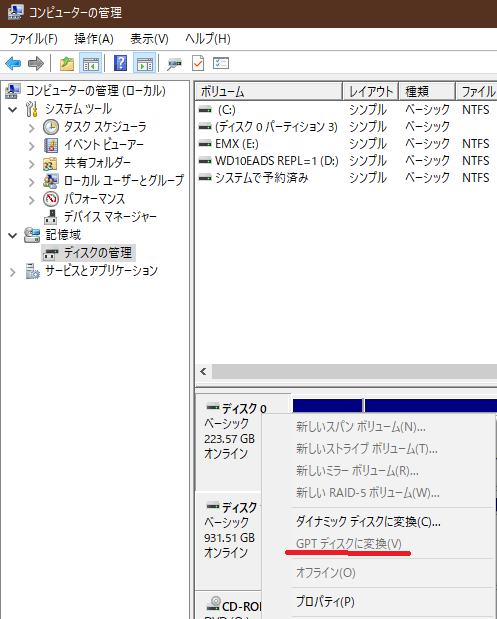
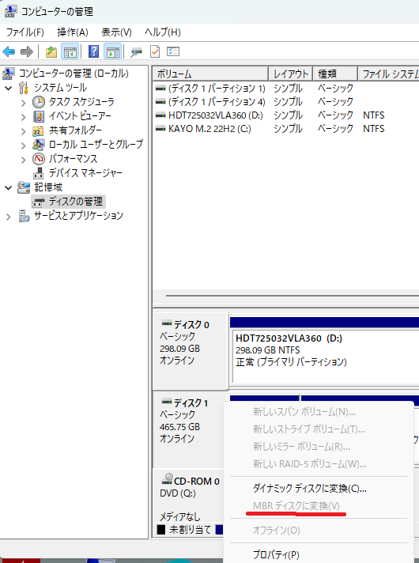
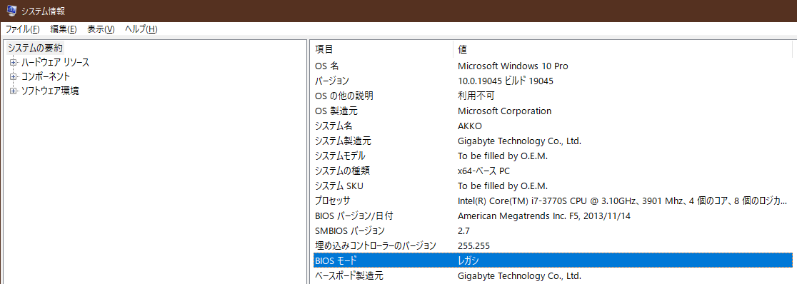
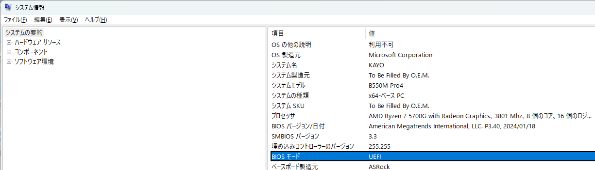
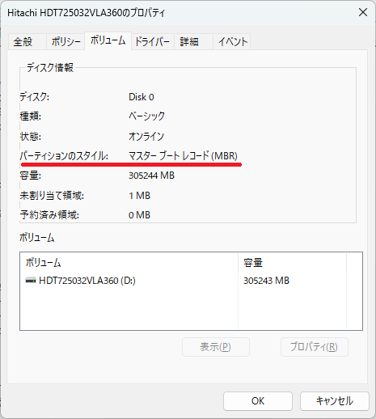
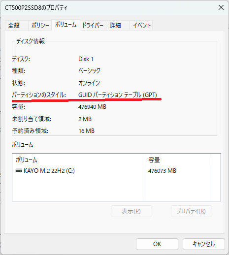

# Windows 10サポート終了に備えた MBR2GPTの使い方

Windows 11をインストールするためには、TPM 搭載のほかに 起動ドライブが GPT(GUID Partition Table) 形式であることが必要です。一般にはBIOSがUEFIモードでブート、とか**セキュアブートが必要**とも表現されますが、いずれも Cドライブが GPT 形式であることが大前提です。GPT パーティション形式は 64bit版 Windows XP で導入されました。しかしWindowsでは歴史的に 32bit アークテチャ(x86) を中心で普及し、昔からの MBR 形式のパーティーションが利用されていることも多く、例え 64bit版 Windows を使用する場合でも MBR 形式が使われて来た事例はよくあります。

ということで、CドライブがMBRパーティーションの状態で Windows を使用していることが原因で Windows 11 をインストール出来ない環境を、OSやデータを保持したまま、GPT 形式に更新するツール、[**MBR2GPT.EXE**](https://learn.microsoft.com/ja-jp/windows/deployment/mbr-to-gpt?WT.mc_id=WDIT-MVP-35878) の使い方と利用上の注意点をお伝えします。**変換操作の前にインストールディスクで起動して、コマンドプロンプトやDISKPARTコマンドなどで、変換対象のディスク番号を調査する必要があります。決して初心者向けの操作では無い点にご注意ください。**

**内容**

- パーティーション形式の調査
- なぜ GPTか？
- GPT 環境簡単構築法
- MBR2GPT 準備
- MBR2GPT 実行
- MBR2GPT トラブル対応
- MBR2GPT 完了後にすること

**パーティーション形式の調査**

最初にパーティーション形式を調査する方法です。もしここに挙げる調査方法でCドライブが「GPT パーティーション形式」であることが確認出来れば、Windows 11 への更新の際にパーティーション形式が障害にはなりません。[**TPM**](https://learn.microsoft.com/ja-jp/windows/security/hardware-security/tpm/trusted-platform-module-overview?WT.mc_id=WDIT-MVP-35878) ([Trusted Platform Module](https://ja.wikipedia.org/wiki/Trusted_Platform_Module)) の有効化と、BIOS のブートモード設定がUEFI であることを確認すれば、Windows 11 をインストールすることが出来るはずです。[なお2024年12月に実質的なCPU要件が撤廃された](https://answers.microsoft.com/ja-jp/windows/forum/all/2024%E5%B9%B412%E6%9C%88%E3%81%AE-windows-11/d4d38ad2-272b-47d3-bd19-fbb5b773da71)ので、CPU要件はここでは扱いません。

**調査方法-1**

コンピューターの管理で Cドライブのディスク（下記の場合はディスク 0）の上で右クリックして表示されるポップアップメニューを観察して、薄っすら「GPT ディスクに変換(V)」があるかどうかを確認する方法です。これが見える場合はMBR形式です。おそらく操作の手間が一番少ないので、一番よく使う方法です。

[](16b0aa0e-99f9-4bb9-b8b0-0c4e7e160faf.png)

.

下記の様に「MBR ディスクに変換(V)」が薄っすらと表示されれば、それは GPT 形式のドライブであることを示します。

[](6a6767d5-6abb-470e-b2b5-770ed7ad4db4.png)

.

**調査方法-2**

別の方法として「MSInfo32」を起動して、他のWindows 11 関連であるセキュアブートの状態とともに確認する方法があります。以下の様にBIOS モードが レガシ と表示される場合は、起動ドライブがMBR形式であると判断出来ます。

[](142e8ced-a6c3-42bb-b597-d448337dc273.png)

.

一方でGPT形式のディスクから起動している場合は、次の通り「UEFI」と表示されます。

[](8fe969d9-fc04-4df4-ae60-803c5051b1a0.png)

,

**調査方法-3**

これまでは間接的に調べる方法を紹介しましたが、直接ディスク形式を確認することも出来ます。デバイスマネージャーの「ディスク ドライブ」のクラスにある、調査対象ディスク（のプロパティ）を開いて、ボリュームタブを開きます。その後「表示」ボタンをクリックすることで、直接現在の物理ディスクのパーティションのスタイル（形式）を読み出して、表示します。

[](cc0c735c-f5d9-4446-8c1d-d7b6fe4408b1.png)

.

GPT 形式の場合は、次の様に表示します。

[](a02c11ec-e021-40fb-a578-f781a1d6c8e4.png)

.

**なぜ GPTか？**

MBR 形式は、初代IBM PC のPC DOS 2.0 を原型にこれまで追加拡張されながら利用されて来たため、x86マシンのブートローダーを先頭ブロックに置き、4個の基本パーティション、最大2TB のディスク容量などといった多くの歴史的な制約があります。一方でGPT 形式ではブートローダーはUEFIに配置、パーティション数の制限が無く、ディスク容量も実質制限がありません。特筆すべきはCRCを活用したパーティション管理テーブルのバックアップ機能です。UEFI の普及にも後押しされ、容量制限の撤廃だけではなく、より安全で柔軟なパーティション管理方式に以降するのは当然の流れと言えます。

この様に優れたGPT形式ですが、Windows 11 での必須要件となる以前に普及しなかったのは、次の理由です。

- BIOS 対応の遅れ
- 優位点の周知の欠如

BIOS対応の遅れは、UEFI ブート搭載BIOSが一般化するまでに少し時間がかかったのと、UEFI ブート搭載BIOSでもデフォルトが非 UEFI の CSM (Compatibility Supported Module) 有効状態がデフォルトで出荷される場合が多かったことです。これにより、例えTPM搭載の x64 Windows 搭載のPCであっても、従来形式との互換性を重視して、MBR 形式でフォーマットされたPCが出荷される場合がありました。この様なPCを Windows 10 で使っていた場合、Windows 11 を使うためにはまさしくパーティション形式を GPT パーティション形式に変更する必要があります。

**GPT 環境簡単構築法**

GPT は物理フォーマットが MBR とは異なるため、データを配置している場合には通常、パーティション形式を変更出来ません。データを別のメディアにバックアップなどしておいて、Cドライブのデータの維持を諦めれば容易に GPT 形式が利用出来ます。MBR2GPT コマンドを使わない、一番簡単な方法です。後述の参考動画の様に、Windows 10やWindows 11の新規インストール時に、インストール対象の PC のBIOSを、UEFI モードを有効にするか、または CSM (Compatibility Supported Module) を無効にしてUEFI モードで PCを起動してから、既存のデータを廃棄して「CLEAN」状態にすることで直ぐに、すなわち新規インストール時に利用が可能になります。

**MBR2GPT の準備**

前述の事情によりMBR2GPT は、古い32bit時代のデータやディスク形式を保全しながら、パーティション形式を最新の GPT 形式に変更するための特殊なツールと言えます。ドライブの物理形式データの書き換えを行うため、実際のところコマンド実行よりも、事前準備、トラブル対応に手間がかかる点に、注意が必要です。

またトラブル対応時は DISKPART など、間違えると回復不能なコマンド操作をするため、利用時は十分な注意も必要になります。準備としては、Windows 10またはWindows 11のMBRパーティーションテーブルで正常動作しているPCを用意して、次の準備事項を確認しておく必要があります。

- USBフラッシュメモリーに、Wアーキテクチャに合わせたindows インストールメディア（ISOファイル）を作成
- 必要な場合は、データのバックアップ
- 必要な場合は、PC の BIOS を最新に更新
- BIOS時に認証が外れる場合あるため、Microsoft アカウントでのサインイン
- CrystalDiskInfo と SCANDISK や Cドライブのスキャンによるディスクの正常性検証
- DISKPART コマンドなどを使用して、Cドライブのパーティーション数を3個以内に調整

1. 操作対象 Windows 向けに作成した**インストールメディアで起動**、言語確認の起動画面で「次へ」

2. コンピューターを修復する を選択

3. トラブルシューティングのコマンドプロンプトを起動

4. DISKPART コマンドとDIRコマンドを駆使して、GPT変換対象のドライブ番号を調査・確認（決まった手順はありません、各自でマッピングされたボリューム内容を注意深く調査・検証する必要があります。）

5. ディスク番号に合わせて変換確認を実行（下記はディスク番号が"1"の場合）

例えば Windows をインストールメディアで起動して、そのインストール先ディスクの設定やパーティーション確認時に既存パーティーションを全て削除するかまたは、Shift-F10 キーでコマンドプロンプト起動、そこで DISKPART.EXE の CLEANコマンドを実行することで Cドライブが空（から）にしてから Windows の新規インストールを実行します。

変換実行手順

MBR2GPT の実行には、いろいろな方法がありますが、これまで十回程度試して、一番安定動作すると思われる手順を紹介します。

その安定動作の前提がこの **インストールメディアで起動** する方法です。通常Windows の動作状態での強制変更は、非推奨です。

1. 対象のバージョンと同じ**インストールメディア** のWindows 10またはWindows 11で起動

2. 進む

3. コマンドプロンプトを起動して、DISKPARTコマンドとDIRコマンドを駆使して、GPT変換対象のドライブ番号を調査・確認

4. ディスク番号に合わせて変換確認を実行（以下はDISKが1 の場合）

```
X:\>mbr2gpt.exe /validate /disk:1
```

5. 変換実行（以下はDISKが1 の場合）

```
X:\>mbr2gpt.exe /convert /disk:1
```

次の様に表示されれば完了。

```
MBR2GPT: Attempting to convert disk 1
```

```
MBR2GPT: Retrieving layout of disk
```

```
MBR2GPT: Validating layout, disk sector size is: 512 bytes
```

```
MBR2GPT: Backing up the system partition
```

```
MBR2GPT: Creating the EFI system partition
```

```
MBR2GPT: Installing the new boot files
```

```
MBR2GPT: Performing the layout conversion
```

```
MBR2GPT: Migrating default boot entry
```

```
MBR2GPT: Adding recovery boot entry
```

```
MBR2GPT: Fixing drive letter mapping
```

```
MBR2GPT: Conversion completed successfully
```

```
MBR2GPT: Update WinRE config file
```

```
MBR2GPT: Before the new system can boot properly you need to switch the firmware to boot to UEFI mode!
```

変換完了後は、BIOS設定でCSM無効化（または UEFI ブート有効化）して、U起動デバイスを Windows ... に設定し完了

トラブル対応

mbr2gpt.exe /convert の実行結果が

Cannot find OS partition(s) for disk 0

の場合は、下記手順を参考にして、MBR 状態での起動パーティション（2番目のパーティーション）のアクティブ化済設定を確認します。このトラブルの原因は、

```
> bootrec /fixmbr
```

```
> bootrec /Rebuildbcd
```

実行で何も表示されないことです。該当起動DISKの第2パーティションを、Active 化した後、再実行することでエラーが無くなるはずです。

```
> diskpart
```

```
DISKPAT> sel disk 0
```

```
DISKPAT> sel part 2
```

```
DISKPAT> active
```

```
DISKPAT> exit
```

> bootrec /Rebuildbcd

これで追加しますか？YesでOK で完了です。

**変換完了後の注意**

Windows 10でパーティーション形式をこの手順で変更した場合は、Windows 11のインストールは Windows Updateでのインストールではなくインプレースアップグレード方式でインストールするか、あるいは Windows Updateでインストールした後で、[**インプレースアップグレード方式でのWindows 11の再インストール**](https://answers.microsoft.com/ja-jp/windows/forum/all/%e3%82%a4%e3%83%b3%e3%83%97%e3%83%ac%e3%83%bc/b6a770d8-56fa-4df4-9621-181eeba5f829)をお勧めします。

詳細な原因は不明ですが、Windows UpdateでWindows 10から更新した環境では、更新後だいたい2年以内に何らかの不具合が発生し、再インストールが必要になることを経験しています。

**参考動画**

[**Windows 10 サポート終了に備えたMBR2GPT の使い方を解説**](https://www.youtube.com/watch?v=mflvgvNBdCU)
