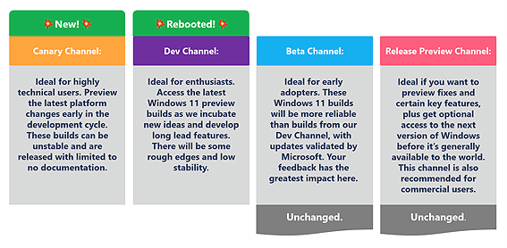
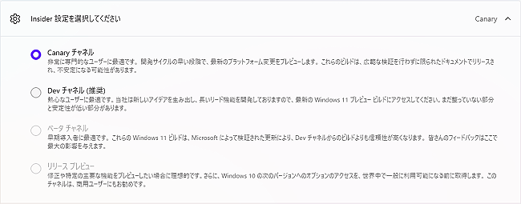
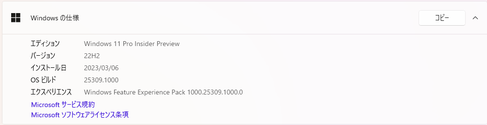
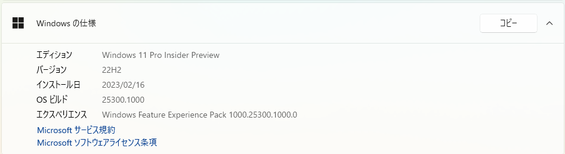

# Windows 11 Insider Canary チャネル 開始

3月6日に [Windows Insider Blog](https://blogs.windows.com/windows-insider/) で、Insider Program の Dev チャネルについて[重要なアナウンスがありました](https://blogs.windows.com/windows-insider/2023/03/06/whats-coming-for-the-windows-insider-program-in-2023/)。

Windows 11 Insider Program の Devチャネル をゼロから再起動することで、開発中の新機能やUXを試すのにより最適な場所に進化させていくとのことです。大きな変更点は「Canary」チャネルが追加されることです。これにより、非常に先進的な、Windows カーネルの大幅な変更や新API追加を含む、開発の早期段階の機能がプレビュー出来る様になります。

Devチャネルは再起動しましたが、基本的にはこれまでの内容とは変わりません。「Canary」チャネルよりも安定した内容の、最新のWindows 11のプレビュー機能を配信します。

元のブログではビルド番号を

- Canary Channel: 25000 series.
- Dev Channel: 23000 series.
- Beta Channel: 22000 series.
- Release Preview: Released versions of Windows 10 and Windows 11.

と記述されていますが、後述の通り、これらの体系は現時点では、まだ使用されていない様子です。今後少しずつビルド番号が、整理・再採番されると推測しています。

※Canary とはカナリア（鳥）のことです。昔炭鉱作業で、いち早く生命に関わる空気や換気の異常を検知するため、カナリアが利用されたことに由来する表現と推測します。危険に気を付ける必要があるという事になります。

参考情報）

[**窓の杜 Microsoft、「Windows Insider」に「Canary」チャネルを新設**](https://forest.watch.impress.co.jp/docs/news/1483723.html#image1_l.jpg)

[**Microsoftサポート：Windows Insider Program に参加する**](https://support.microsoft.com/ja-jp/windows/windows-insider-program-%E3%81%AB%E5%8F%82%E5%8A%A0%E3%81%99%E3%82%8B-ef20bb3d-40f4-20cc-ba3c-a72c844b563c)

重要な注意

今回、ある意味危険とも言える「Canary Channel」の追加により、Insider Program の各チャネルへの参加は、より慎重に対応する必要があります。Insider Program の各チャネルに参加した後、離脱して**「正規リリース版」に戻すためには、これまで同様に Windows の再インストールしか方法がありません。**従って、Insider Program の各チャネルへに参加する場合は、いつ起動しなくなっても構わない、「余剰のマシン」や「仮想マシン」でだけ参加するべきです。実際に私は以前22H1で Dev Channel 参加のマシンが2台とも、去年の22H2 更新直前の Windows Update の際、それぞれ別のタイミングで二度と起動しなくなり、再インストールを余儀なくされましました。

**Windowsを普通に、または最適な環境で使いたい人は、 Insider Program に参加するべきではありません。**Window用の各種ソフトウェア、ハードウェアや周辺機器を開発している会社や研究機関と、個人的な趣味や興味、実験、研究として新しいWindowsを評価したい人が利用するためのプログラム（制度）であると理解して下さい。

Insider Program 参加では、[**フィードバック Hub での報告**](https://support.microsoft.com/ja-jp/windows/%E3%83%95%E3%82%A3%E3%83%BC%E3%83%89%E3%83%90%E3%83%83%E3%82%AF-hub-%E3%82%A2%E3%83%97%E3%83%AA%E3%82%92%E4%BD%BF%E3%81%A3%E3%81%A6-microsoft-%E3%81%AB%E3%83%95%E3%82%A3%E3%83%BC%E3%83%89%E3%83%90%E3%83%83%E3%82%AF%E3%82%92%E9%80%81%E4%BF%A1%E3%81%99%E3%82%8B-f59187f8-8739-22d6-ba93-f66612949332)が求められています。参加者には特別に新しい経験がの機会が供与されますが、Windows システム開発に役立つフィードバックが期待されています。フィードバック Hub のレポートには、Windows の開発者から直接返信がくる場合があります。数少ない Windows 開発 に参加する機会を活用しましょう。

Insider チャネルの選択

現時点では、元 Dev チャネル の環境では、「Canary チャネル」と「Dev チャネル」のいずれかが選択可能です。一度どちらを選択した後、それぞれ別（と推測される）の Windows Updateを適用しても、このどちらへも移動出来る状況は変わりません。いずれ移動不可になり、その後にビルド番号が再割り当てされるのではないかと推測しています。

Canary チャネル

カーネルの大幅な変更や新API追加といった、エンドユーザーへのリリースには長い期間を要す「プラットフォームの変更」をプレビューする場所と定義しています。以前の Dev チャネルと同様、製品に搭載されない場合があります。これまでの Dev チャネル同様に 25000シリーズのビルド番号が割り当てられ、これまでDevチャネルを購読していた人向けの、より高い番号のチャネルです。「Canary チャネル」はビルド後、即配信する「hot off the presses」となります。これは**PCが正常に動作しなくなるとか、再インストールが必要になるといった重大な問題が含まれる場合があるという事です。**そして今後は、リリースのサイクルがこれまでの Dev チャネルよりさらに短くなる可能性があります。

Dev チャネル

Dev チャネルは再起動しましたが、多くはこれまでとは同じです。新しい機能やUXが配信されますが、なかには最終的に製品化されないものが含まれる点も同じです。準備次第では、その後のリリースに登場するものが含まれます。「Canary チャネル」で配信されてから、「Dev チャネル」で登場する機能もあり、その場合はより安定した実装となります。従って **ほとんどの Insider には、この「Dev チャネル」への登録をお勧めします。**

Beta チャネル

Beta チャネル の定義はこれまでと変わりません。最近の説明は「より信頼性の高い更新プログラムを希望し、インパクトのあるフィードバックを提供したい場合」と、抽象的で分かり難いのですが、以前の説明では、数か月先から半年以内にリリース予定の機能が配信されるとされていました。Dev チャネルの様に、配信されてもリリースされない場合があるということは無い様子です。

Release Preview チャネル

Release Preview チャネル の定義はこれまでと変わりません。毎月ある、Windowss Updateの更新の次回配信予定分の公開が中心となります。22H2リリース前は、Windows 10 の Release Preview チャネル 参加では、無条件にWindows 11への更新が行われていましたが、今はWindows 10とWindows 11はそれぞれ別の内容が配信されています。

参考情報

[**Microsoft コミュニティ：Windows Insider Programについて**](https://answers.microsoft.com/ja-jp/insider/forum/all/windows-insider/dcff8930-0558-458a-9c54-2d8be8c9c168)

補足情報

現時点では、[Windows のプレビューを開始する](https://insider.windows.com/ja-jp/preview-windows) 等の **Windows プレビュー チャネルを選択する** などの各チャネルの解説は従来のままです。以前、Windows 10 22H2 Insider Preview の Preview Chanel の内容説明の改訂に2か月程度を要したことから推測すると、これらの「新しいチャネル」の説明や運用が定着するには、少し時間がかかりそうです。
