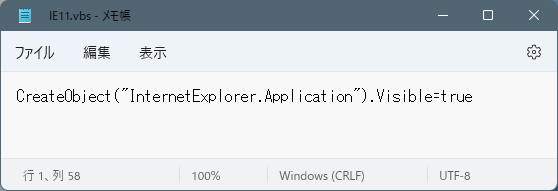
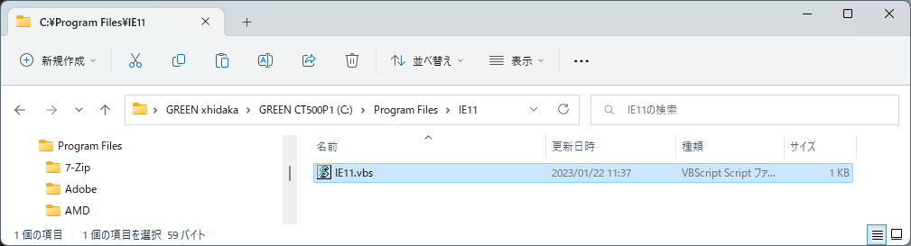
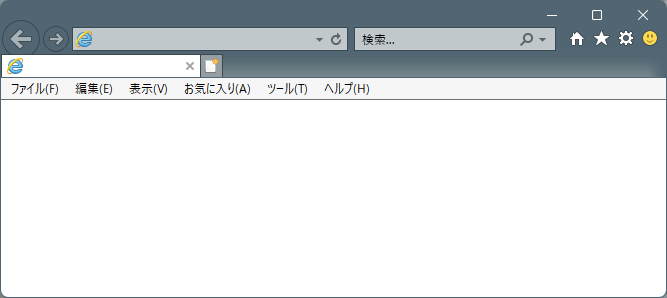
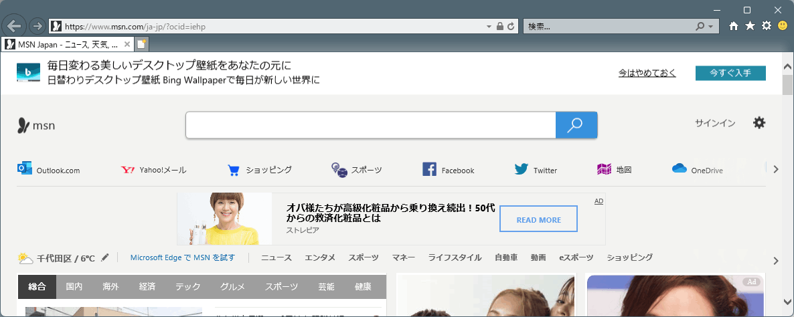

# インターネットエクスプローラー IE11みたいなものを使う

**テクニカル レベル** : 中級

**概要**

今年の5月で、インターネットエクスプローラー（IE11）が廃止になって約1年です。個人的にはEdgeのIE互換機能が強力なこともあり、近年まれに見るパーフェクトなマイグレーション手順だったと思うのですが、まれに未だにIE11を様々な工夫して使おうとしている人の様々な（無駄な？）苦労を見ます。なので、意外と知られていないIE11（みたいなものを）最新Windows環境でも常時、簡単に利用する方法を示します。

**ポイント**

実はEdgeの中にはかつて惜しまれながら無くなった「IE11そのものが内蔵されている」と噂されています。従ってこのIE11そのものの互換機能を、IE11として呼び出すということだけです。

**手順**

まず、メモ帳などのテキストエディターを開いて次の文字列を入力し、「ie11.vbs」などの分かり易い名前で、保存してます。

＜＜コピペ用テキスト：ここから＞＞

```
CreateObject("InternetExplorer.Application").Visible=true
```

＜＜コピペ用テキスト：ここまで＞＞

ファイル名は何でも良く、保存先はどこでも構いません。

メモ帳で開くと、次の様になります。

[](6eb40669-9113-4b50-90e6-8a739f33bdc2.png)

動作確認後、常用するのであれば、管理者でサインインして、以下の様なProgram Filesにこの「IE11」もどき用のフォルダーを作成してそこに置き、ショートカットをスタートやデスクトップなどに配置して呼び出すことをお勧めします

[](c002d0a5-7d0b-4a2f-a3ad-12e1d7fc8140.png)

以下にこの様にして作成した、「IE11.vbs」のショートカットを開いた状態の画面を示します。

[](a2a56260-77d3-493c-9f6a-874a31726df1.png)

操作はIE11とほぼ同じです。例えば「ホームアイコン」をクリックすると、MSNトップページが開きます。

[](e4c2cceb-c771-4160-830c-a72671281ac2.png)

この様な機能は、Microsoft Edgeに内蔵されるIE11互換機能を使用して実行しているわけですが、実はそのIE11互換機能がEdgeに搭載されるのが、いつまでなのかについては、不透明な部分があります。あくまでも互換機能はアプリやサイトがEdge未対応な間だけの緊急避難的な使い方として、メインで使用するブラウザはMicrosoft Edge等のモダンなブラウザに移行して行くべきと考えます。ご注意ください。
