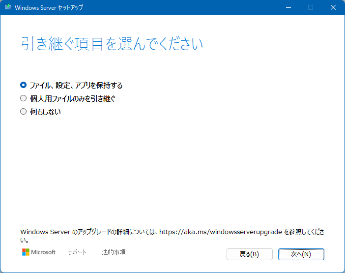

# インプレースアップグレード方式によるWindowsの修復目的の再インストール

今週のWindows Update 以降、インプレースアップグレード方式での再インストール について、回答に引用する機会が多いので記事にしてみました。自分でもここ1か月ぐらいの間にこれを4回実行して、全て完璧に以前使っていたアプリが動作することを確認しました。さらにこれを実行後、一時ファイルから「以前のWindows を削除」することで、使用していた内5GB程度のディスク容量が領域回収（空き容量増）することを確認済です。

参考）

[Sway: Windows10 修復インストール方法](https://sway.office.com/aJojRyhCeaVzFTSc)

[Microsoft: Windows でインプレース アップグレードを実行する方法](https://learn.microsoft.com/ja-jp/troubleshoot/windows-server/setup-upgrade-and-drivers/repair-or-in-place-upgrade?WT.mc_id=WDIT-MVP-35878)

自己流の方法ですが、ご自由に引用して、役立ててください。

重要データのバックアップを取った上で、以下を順に実行します。

１．CrystalDiskInfo 検証

Microsoftストアで、CrystalDiskInfoをインストールしてCドライブの水色表示確認

黄色か赤ならば故障なので、以降に進まずディスク交換などの修理が必要です。しかし最近の M.2 / SSDは故障でも多く場合が水色表示となるため、実質的には気休め程度と考えています。

２．ドライブのスキャンチェック

[**クリーンブートで起動**](https://support.microsoft.com/ja-jp/topic/windows-%E3%81%A7%E3%82%AF%E3%83%AA%E3%83%BC%E3%83%B3-%E3%83%96%E3%83%BC%E3%83%88%E3%82%92%E5%AE%9F%E8%A1%8C%E3%81%99%E3%82%8B%E6%96%B9%E6%B3%95-da2f9573-6eec-00ad-2f8a-a97a1807f3dd)後、Cドライブのプロパティ、ツール タブ でドライバーのチェック、**ドライブのスキャン を実行**

エラーが出る場合は、出なくなるまで繰り返し

（クリーンブートでの起動は、セキュリティソフトや各種常駐スタートアップサービスの影響排除が目的）

.

３．インプレースアップグレード実行

Microsoftアカウントでサインイン後、[**クリーンブートで起動**](https://support.microsoft.com/ja-jp/topic/windows-%E3%81%A7%E3%82%AF%E3%83%AA%E3%83%BC%E3%83%B3-%E3%83%96%E3%83%BC%E3%83%88%E3%82%92%E5%AE%9F%E8%A1%8C%E3%81%99%E3%82%8B%E6%96%B9%E6%B3%95-da2f9573-6eec-00ad-2f8a-a97a1807f3dd)してから、[**Windows 11 ISOファイルを作成**](https://www.microsoft.com/ja-jp/software-download/windows11)してマウントし、中のsetup,exe を起動して、インプレースアップグレード方式での再インストール（の本番）

（Microsoftアカウントでサインインは、万が一のトラブル発生時のOneDrive同期のバックアップとライセンス保守が目的）

途中で引き継ぐ項目を下記の通り指定することで、今のアカウント、全てのアプリとデータがそのまま使えます。

.

4. ご注意

M.2やSSDを使用している場合に M.2/SSD の故障があるとこの方法では修復出来ません。事前の交換修理が必要です。
