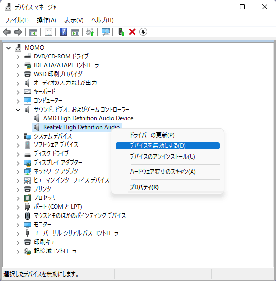
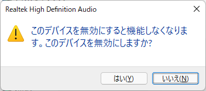
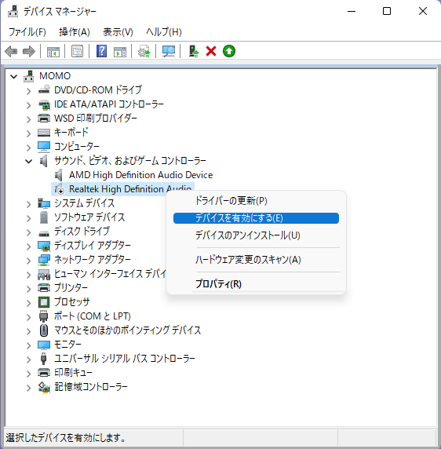
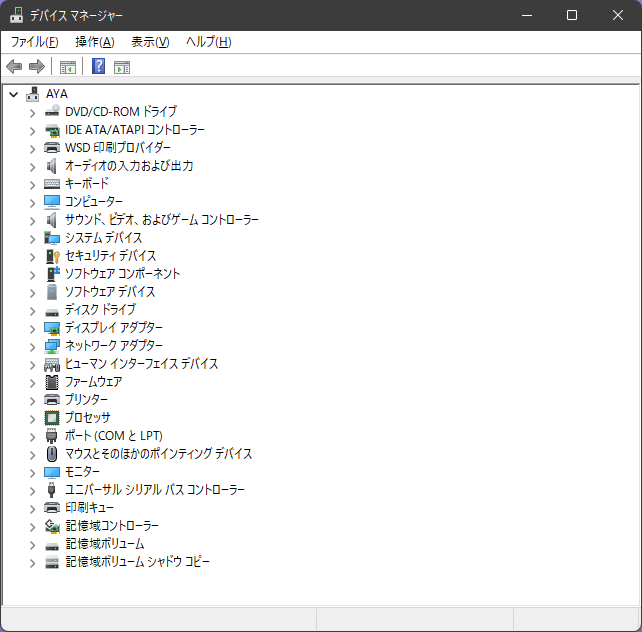
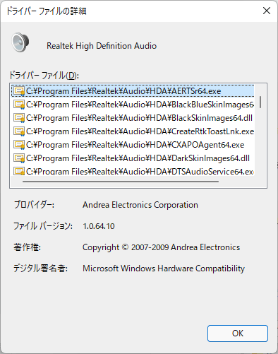
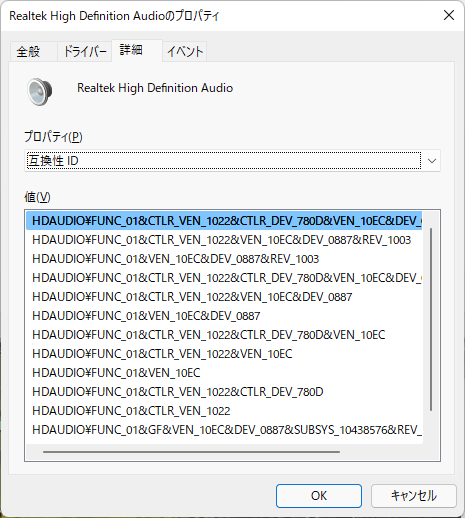
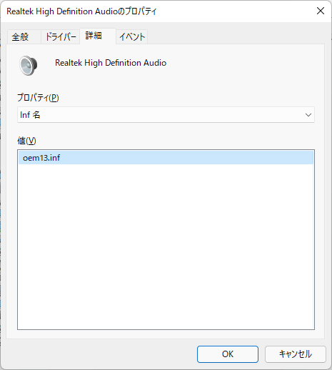
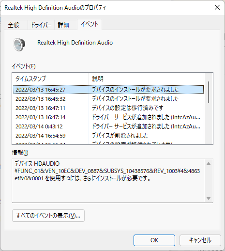

# デバイスマネージャーと他のツール（上級編）

**テクニカル レベル** : 上級

**関連記事**

[デバイスマネージャーの起動](https://answers.microsoft.com/ja-jp/windows/forum/all/%E3%83%87%E3%83%90%E3%82%A4%E3%82%B9%E3%83%9E/981a79d0-cf25-460b-9b94-6426dfafca74)

[ドライバーのインストールとは？](https://answers.microsoft.com/ja-jp/windows/forum/windows_11-hardware/%e3%83%89%e3%83%a9%e3%82%a4%e3%83%90%e3%83%bc/c4821319-3103-4bc3-b21d-dbf7da7e3363)

[ドライバー インストール方法](https://answers.microsoft.com/ja-jp/windows/forum/windows_11-hardware/%e3%83%89%e3%83%a9%e3%82%a4%e3%83%90%e3%83%bc/b6b95c1a-bd55-4ba3-878a-db0b36602f30)

[ドライバー更新と削除](https://answers.microsoft.com/ja-jp/windows/forum/windows_11-hardware/%e3%83%89%e3%83%a9%e3%82%a4%e3%83%90%e3%83%bc/8f602fc4-433f-4b5e-b948-178d0a51c11d)

**デバイスマネージャーと他のツール（上級編）**

[ドライバーパッケージを探すには](https://answers.microsoft.com/ja-jp/windows/forum/windows_11-hardware/%e3%83%89%e3%83%a9%e3%82%a4%e3%83%90%e3%83%bc/b82904f7-d567-4fdc-9e2f-4239389eef93)

[デバイスマネージャー](https://answers.microsoft.com/ja-jp/windows/forum/all/%E3%83%87%E3%83%90%E3%82%A4%E3%82%B9%E3%83%9E/981a79d0-cf25-460b-9b94-6426dfafca74) の他の機能と他のツールを紹介します。

デバイスマネージャー（上級編）

デバイスマネージャーではデバイスとドライバーに関する事を確認、操作出来る様になっています。ここではデバイスのインストール操作以外の、上級的な次の使い方を説明します。

- 有効化と無効化
- 非表示のデバイスの表示
- ドライバー タブ
- 詳細タブ
- イベントタブ

有効化と無効化

デバイスマネージャーが管理する各デバイスノードの 有効化・無効化をします。この機能はドライバーやデバイスの開発時によく使用しますが、あまり知られていません。これにより、対象デバイスを取り外すかまたは電源を切らなくても、同じ操作が可能です。カメラ、ネットワーク、マイク、スピーカーなどといったあらゆるデバイスで、一時的にデバイスを停止または遮断し、後で復旧させることが可能です。

無効にする場合は、対象デバイスを右クリックして **デバイスを無効にする** を選択します。以下は Realtek High Definition Audio デバイスの操作例です。

  
（デバイスマネージャー **デバイスを無効にする**）

確認のダイアログが表示されるので、**はい** で答えます。

  
（Realtek High Definition Audio 確認ダイアログ）

無効になった状態では、デバイスアイコンに黒い下向き矢印が表示されます。

再度有効にする場合は、右クリックで **デバイスを有効にする** を選択します。

  
（デバイスマネージャー デバイスを有効にする）

Windows 内部ではこのデバイスの有効・無効の操作は、実デバイスの接続・切断と同等です。同じドライバーの初期化処理と終了処理を実行します。しかし実デバイスの操作とは動作するタイミングが異なるため、トラブル発生時にはこの機能が問題解決に有効な場合があります。例えば接続するポートや接続時のプラグイン操作に厳しい、いわば相性問題があるUSBデバイスでは、この有効化・無効化 操作の実行によって正常に動作する場合があります。

非表示デバイス

デバイスマネージャーには全てのデバイスが表示されていません。例えばインストールされていても、接続（動作）していないデバイスや、一部のシステムデバイス（レガシ デバイス）の様に非表示となっているデバイスがあります。これらのデバイスは、非表示デバイスの表示機能で表示可能です。

デバイスマネージャーの表示メニューで、**非表示デバイスの表示** を選択することでこの機能を有効にで来ます。

（デバイスマネージャー **非表示のデバイスの表示** 操作）

以下は非表示のデバイスを表示させた例です。WSD印刷プロバイダーや記憶域ボリュームなどの非表示のデバイスが表示されています。これにより、過去に接続していたデバイスを調べることが出来ます。

（デバイスマネージャー **非表示のデバイスの表示** 後）

ドライバー タブ

各デバイスノード表示における ドライバータブは、ドライバーの詳細情報とノードの右クリックでも操作できる更新や有効化・無効化を操作できます。  

（デバイスマネージャー ドライバータブ ドライバーの詳細）

以下は **ドライバーの詳細** ボタンをクリックときのドライバーファイルの詳細の表示例です。INF中に含まれるドライバーを構成する全ファイルのパス名、提供元（プロバイダー）、バージョン、署名を確認出来ます。

（ドライバー ファイルの詳細 表示例）

詳細タブ

詳細タブは、そのドライバーの詳細パラメーターを表示します。プロパティのプルダウンメニューで、表示する項目を設定すると 値 にその内容が表示されます。以下は [**ハードウェア ID**](https://docs.microsoft.com/ja-jp/windows-hardware/drivers/install/hardware-ids?WT.mc_id=WDIT-MVP-35878) を表示させた例です。ハードウェア ID はデバイスを識別するキーとなる文字列です。未インストールのデバイスでは、この値を調べることによりどのドライバーを必要なのかを確認出来ます。

（詳細タブ **ハードウェアID** 表示例）

以下は [**互換性 ID**](https://docs.microsoft.com/ja-jp/windows-hardware/drivers/install/compatible-ids?WT.mc_id=WDIT-MVP-35878) の表示例です。デバイス側が受け入れ可能な 互換性ID の一覧を知ることが出来ます。

（詳細タブ **互換性ID** 表示例）

Inf 名 の表示例です。ドライバーストア経由でインストールするドライバーの INFは、名前を C:\Windows\INF\oem99.inf の様なファイル名に変更されて C:\Windows\INF 以下にコピーされます。このInf名 は現在動作しているドライバーのINFフォルダーでのファイル名を表示します。

（詳細タブ Inf名）

イベントタブ

**イベント** タブはそのデバイスで発生したイベント内容を表示します。そのデバイスの動作状況を確認出来ます。すべてのイベントの表示 ボタンをクリックすると イベントビューアーのSYSLOG機能で該当デバイスの全てのイベントを表示します。  

（イベントタブ 表示例）

[他のツール：PnPUtil](https://docs.microsoft.com/ja-jp/windows-hardware/drivers/devtest/pnputil?WT.mc_id=WDIT-MVP-35878)

ドライバー インストール方法 のドライバーファースト手順でも紹介した、Windows標準コマンドとして用意されているPnPUtil ツールです。コマンドプロンプトから実行して、ドライバー インストールに必要な操作を行います。以下に一般的な利用方法を示します。コマンドの実行には、対象デバイスが持つ権限やINFの記述内容によっては管理者権限が必要な場合があります。

使いかたを表示します。

> pnputil /?

INFを指定してドライバー パッケージをプレインストール（ドライバーストアに登録）します。

> pnputil /add-driver c:\temp\driver.inf

INFを指定してドライバー パッケージを追加（ドライバーストアに登録）後、該当デバイスに接続してインストール動作を行います。

> pnputil /add-driver device.inf /install

ドライバーストア登録済のドライバーパッケージの一覧を表示します。

> pnputil /enum-drivers

ドライバー パッケージを削除します。

> pnputil /delete-driver oem0.inf

ドライバー パッケージを強制的に削除します。

> pnputil /delete-driver oem1.inf /force

他のツール：Devcon

[Windows デバイス コンソール (Devcon.exe)](https://docs.microsoft.com/ja-jp/windows-hardware/drivers/devtest/devcon?WT.mc_id=WDIT-MVP-35878) は WDK (Windows Driver Kit) や Windows SDK に組み込まれて開発者向けに配布されている開発用ツールです。最近では市販の IoT開発ツールの一部として周辺デバイスメーカーが配布していることがあります。元々はドライバーインストール用ツールを開発し易くするために、デバイスマネージャーと同等機能を実行することを考慮したオープンソースのコンソールアプリケーションです。従ってデバイスマネージャーが実行できることは全てコマンドプロンプトや他のプログラムから Devcon を呼び出すことで実行できます。従って PnpUtil と同様に、ドライバーのインストール操作に利用することもできますが、現在では PnpUtil の利用が推奨されています。Devcon のソースコードは以下から入手できます。

[参考リンク：GitHub Windows ドライバーサンプル](https://github.com/microsoft/Windows-driver-samples)

[参考リンク：Devcon ソースコード](https://github.com/microsoft/Windows-driver-samples/tree/master/setup/devcon)
