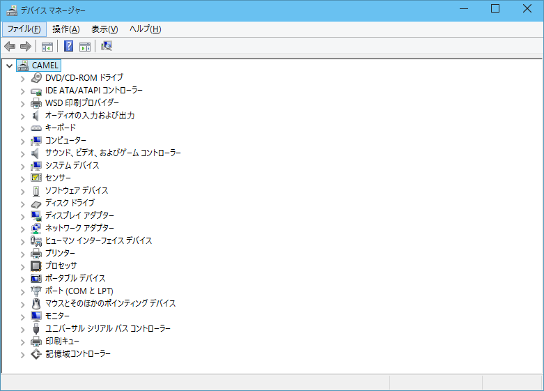
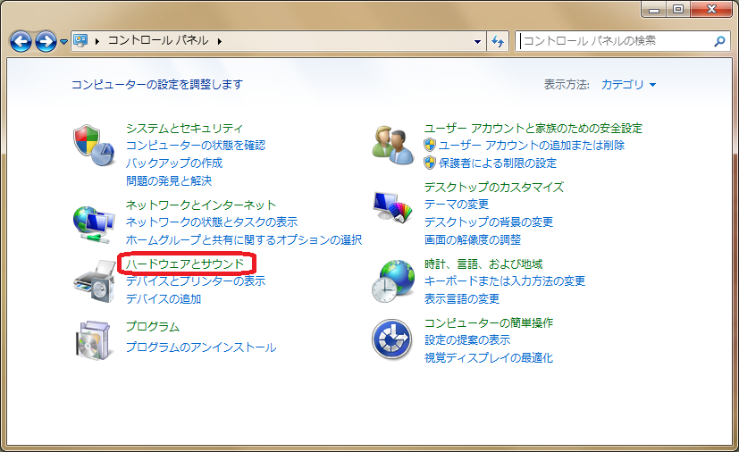
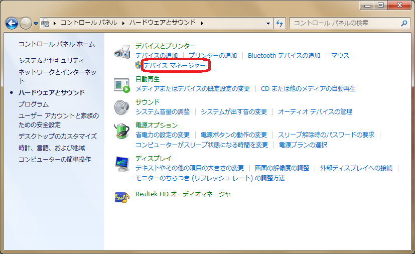
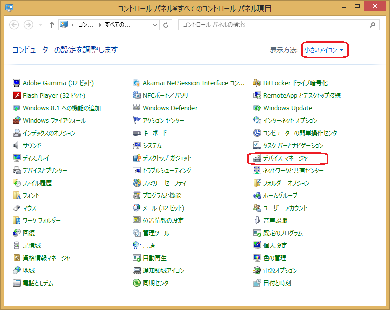
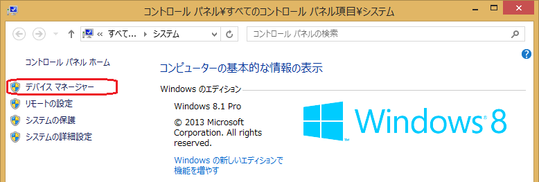
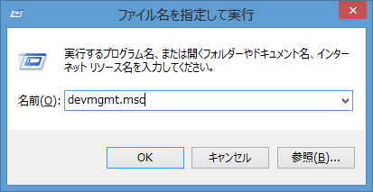
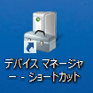

# デバイスマネージャーの使い方

**テクニカル レベル** : 中級

**関連記事**

**デバイスマネージャーの起動**

[ドライバーのインストールとは？](https://answers.microsoft.com/ja-jp/windows/forum/windows_11-hardware/%e3%83%89%e3%83%a9%e3%82%a4%e3%83%90%e3%83%bc/c4821319-3103-4bc3-b21d-dbf7da7e3363)

[ドライバー インストール方法](https://answers.microsoft.com/ja-jp/windows/forum/windows_11-hardware/%e3%83%89%e3%83%a9%e3%82%a4%e3%83%90%e3%83%bc/b6b95c1a-bd55-4ba3-878a-db0b36602f30)

[ドライバー更新と削除](https://answers.microsoft.com/ja-jp/windows/forum/windows_11-hardware/%e3%83%89%e3%83%a9%e3%82%a4%e3%83%90%e3%83%bc/8f602fc4-433f-4b5e-b948-178d0a51c11d)

[デバイスマネージャーと他のツール（上級編）](https://answers.microsoft.com/ja-jp/windows/forum/windows_11-hardware/%e3%83%87%e3%83%90%e3%82%a4%e3%82%b9%e3%83%9e/121166d7-ec27-49ad-a470-4473fcf8a703)

[ドライバーパッケージを探すには](https://answers.microsoft.com/ja-jp/windows/forum/windows_11-hardware/%e3%83%89%e3%83%a9%e3%82%a4%e3%83%90%e3%83%bc/b82904f7-d567-4fdc-9e2f-4239389eef93)

**概要**

デバイスマネージャーはデバイスとデバイスドライバーを管理するためのユーザーインターフェースです。普段は目にすることがない、また気にしなくても通常の作業には影響が無いツールですが、PCに新しいデバイスを接続する時、デバイスドライバー（以下ドライバーと省略）をインストールしたり、状態を確認したりする時など、使い方を知っておくと便利なツールです。デバイスマネージャーの表示例を示します。

ここではWindows 8, Windows 8.1 あるいは今後リリースされるWindows 10では機能や使い勝手がいくつか更新されるので、それらも含めたデバイスマネージャーについて紹介します。手始めにここでは皆さんが知っているようで、実はあまり詳しくは知られていないデバイスマネージャーの**役割と起動方法**について解説します。

**詳細**

起動方法

以下に一般的なデバイスマネージャーの起動方法を挙げます。どの手順で起動しても機能は変わりません。複数同時に起動することも可能ですが、デバイスとドライバーのインストールの際などにはトラブルの元になる場合もあるので、通常は１つだけ起動することをお勧めします。

Windowsキーから

Windows 8ではWindowsキーから素早く起動することが可能です。Windowsキーを押しながら「x」を押して「m」を押すか、または表示メニューで「デバイス
マネージャー(M)」を選択します。以下はWindows 8.1で「Windows-x」押下時に表示されるポップアップメニューです。

コントロールパネルから（カテゴリ表示）

コントロールパネルを開きます。 カテゴリ表示になっている場合には、画面の「ハードウェアとサウンド」をクリックします。

次に開いた画面の「デバイスとプリンター」の項目にある「デバイスマネージャー」をクリックして起動します。

コントロールパネルから（大きいアイコンまたは小さいアイコン）

コントロールパネルを開きます。 「大きいアイコン」または「小さいアイコン」の表示の場合はそのまま
「デバイスマネージャー」を探してクリックして起動します。カテゴリ表示とは右上の「表示方法：」のプルダウンメニューで切り替えできます。

コンピューターアイコンから

デスクトップメニュー等のコンピューターを右クリックして「プロパティ(R)」を選択します。右上に「デバイス
マネージャー」のアイコンが表示されるのでクリックして起動します。

コントロールパネルのシステムから

コントロールパネルのシステムアイコンを開くと前項のコンピューターアイコンのプロパティメニューが表示されるので、同様に起動できます。

コマンドラインから

これは上級者向けの機能です。「ファイル名を指定して実行」や検索窓、コマンドプロンプトから「devmgmt.msc」のコマンドで起動できます。このコマンドの実体はC:\Windows\System32以下にあるので、これを指定してショートカットを作成することも可能です。

ショートカットから（ショートカットの作成方法）

ドライバーのメンテナンスや開発時等で頻繁に使用する場合には、ショートカットアイコンを作成しておくと便利です。前述のコントロールパネルで「デバイス
マネージャー」アイコンを右クリック選択してショートカットの作成（S）を選択すると、デスクトップに作成されます。

