# ドライバー インストール方法

**テクニカル レベル** : 上級

**関連記事**

[デバイスマネージャーの起動](https://answers.microsoft.com/ja-jp/windows/forum/all/%E3%83%87%E3%83%90%E3%82%A4%E3%82%B9%E3%83%9E/981a79d0-cf25-460b-9b94-6426dfafca74)

[ドライバーのインストールとは？](https://answers.microsoft.com/ja-jp/windows/forum/windows_11-hardware/%e3%83%89%e3%83%a9%e3%82%a4%e3%83%90%e3%83%bc/c4821319-3103-4bc3-b21d-dbf7da7e3363)

**ドライバー インストール方法**

[ドライバー更新と削除](https://answers.microsoft.com/ja-jp/windows/forum/windows_11-hardware/%e3%83%89%e3%83%a9%e3%82%a4%e3%83%90%e3%83%bc/8f602fc4-433f-4b5e-b948-178d0a51c11d)

[デバイスマネージャーと他のツール（上級編）](https://answers.microsoft.com/ja-jp/windows/forum/windows_11-hardware/%e3%83%87%e3%83%90%e3%82%a4%e3%82%b9%e3%83%9e/121166d7-ec27-49ad-a470-4473fcf8a703)

[ドライバーパッケージを探すには](https://answers.microsoft.com/ja-jp/windows/forum/windows_11-hardware/%e3%83%89%e3%83%a9%e3%82%a4%e3%83%90%e3%83%bc/b82904f7-d567-4fdc-9e2f-4239389eef93)

[ドライバーのインストール](https://answers.microsoft.com/ja-jp/windows/forum/windows_11-hardware/%e3%83%89%e3%83%a9%e3%82%a4%e3%83%90%e3%83%bc/c4821319-3103-4bc3-b21d-dbf7da7e3363)は、ドライバーパッケージをドライバーストアにコピーしてからドライバーの初期化処理を完了するまでの一連の流れです。ドライバーのインストールには次のシナリオ（方法）があります。

- デバイスファースト
- ドライバーファースト
- その他のドライバー
- TXTSETUP.OEM

ドライバーのインストールが必要な場合は通常、デバイス提供メーカーがドライバーのインストール手順を指定しているか、またはインストールプログラムを用意しているため、実際にユーザーがこれらの手順でインストールすることは少ないです。しかしWindowsのOSアップデート等でのドライバー問題発生時、あるいはメーカーが新しいバージョンのドライバーを公開した場合、あるいは後述の標準ドライバーの自動インストール問題があるので、覚えておいて損はない知識です。

デバイスファースト手順

デバイスを先にPCに接続するか、または接続済デバイスの電源をONにする方法です。ソフトウェアデバイス（仮想デバイス）が動作開始する場合もこれに該当します。

Windowsは [プラグアンドプレイマネージャー](https://docs.microsoft.com/ja-jp/windows-hardware/drivers/install/pnp-manager?WT.mc_id=WDIT-MVP-35878) が新しいデバイスを検出すると、適合するドライバー（実体はINF）を、INFフォルダー（C:\Windows\INF）、ドライバーストアと検索してインストールします。もしドライバーが見つからない場合、以下のST-Link Debug デバイスの様にデバイスマネージャーにドライバー未インストールを示す黄色い三角マーク付きデバイスを表示します。

[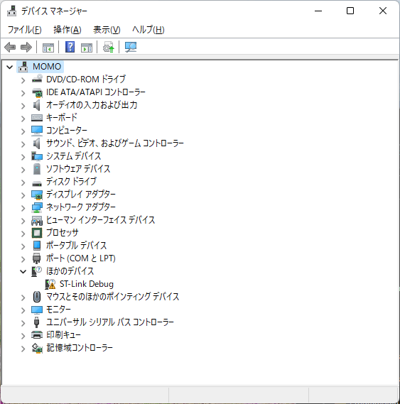](fdbc0f12-8f5e-4002-b2fb-0e53798a7189.png)  
（デバイスマネージャー ドライバー未インストールを示す黄色い三角マーク付きデバイス）

このドライバー未インストールデバイスを開くと、次に示すように「このドライバーがインストールされていません」というデバイスの状態が表示されます。

[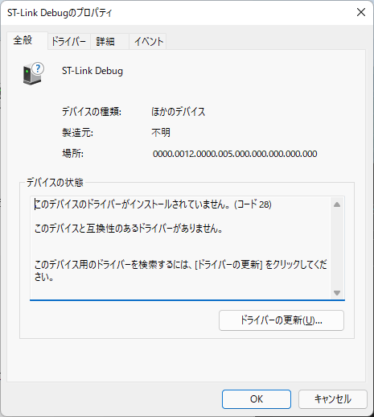](61349c48-d689-4a61-9752-4fdd8b57afff.png)

（この ST-Link Debug デバイス ドライバーがインストールされていません 表示）

もしこのシナリオで、プラグ アンドプレイマネージャー が該当するドライバーを発見した場合、すぐにドライバーのインストールを開始します。すでにドライバーパッケージがプレインストール済なので、これは次項で説明のドライバーファーストのシナリオとなります。

インストール手順

デバイスファーストのシナリオで、未検出状態の場合からのインストール手順を説明します。引き続き未インストール状態の ST-Link Debug デバイスを例にして説明します。まず対象デバイスメーカーが用意するドライバーパッケージのファイルまたはフォルダーを確認、またはローカルストレージに用意します。ドライバーパッケージはCD-ROMやUSBメモリーにあっても構いません。デバイスによっては、Windows Updateでダウンロード、インストール可能な場合もあります。この ST-Link Debug デバイスの例では STMicroelectronics社 のサイトから en.stsw-link009_v2.0.2.zip ドライバーをダウンロードしておいたので、これを展開して利用します。

ドライバー未インストール デバイスを右クリックして、**ドライバーの更新** を選択してインストールを開始します。

[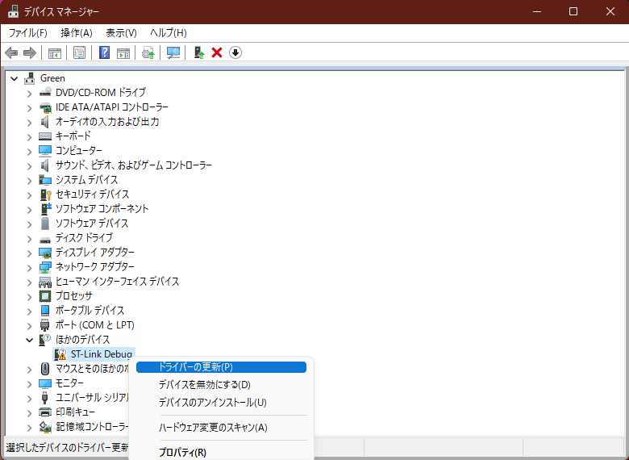](cc3022be-39c9-4737-b55a-506af61fa7ad.png)

（デバイスマネージャー ドライバー未インストールの ST-Link Debug を右クリックしてドライバーの更新を選択）

次に表示されるダイアログで **コンピューターを参照してドライバーを検索** をクリックして進みます。

[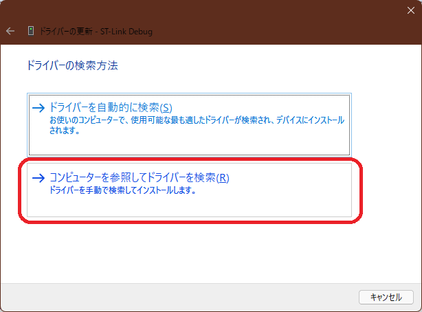](6cf24f46-2999-4222-8248-ae699e8cbb7b.png)

（ドライバーの更新 ダイアログ コンピューターを参照してドライバーを検索）

ドライバーパッケージのフォルダー選択画面になるので、**コンピューター上の利用可能なドライバーの一覧から選択します** の方をクリックして進みます。  
[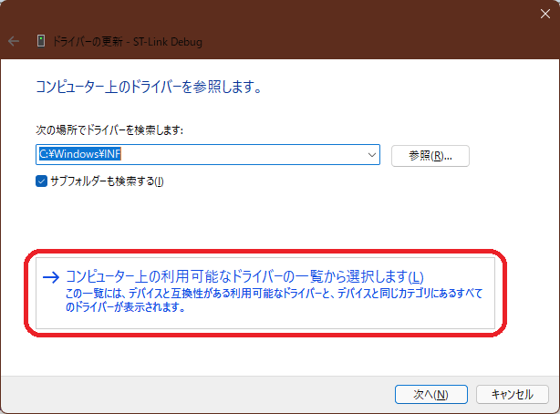](90074eeb-6309-42b9-a7b9-9f3cc75469c0.png)

（ドライバーの更新 ダイアログ コンピューター上の利用可能なドライバーの一覧選択）

そのまま **次へ** をクリックして進みます。

[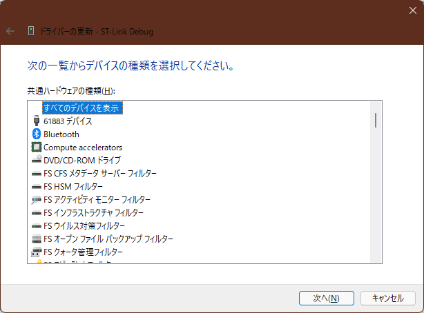](4cfccedb-1b74-4ed3-a5a0-4ff76b97c5ed.png)  
（ドライバーの更新 一覧からデバイス種類の選択）

**ディスク使用** をクリックして進みます。

[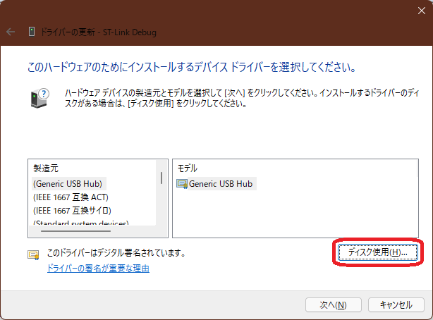](78fae589-0575-4ea1-850c-32517fd223c9.png)

（ドライバーの更新 ダイアログ **ディスク使用** ボタン）

参照 をクリックして 展開したフォルダー（ドライバーパッケージ）の場所を指定します。

[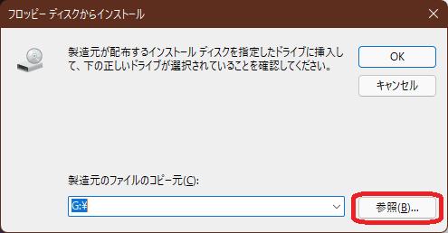](59a54f62-122a-4881-8742-3a2bd4e10869.png)

（**フロッピーディスクからインストール** の古風なダイアログ、Feedback で「フロッピーディスク」のタイトル修正依頼中！）

ファイルの場所を指定すると INF 拡張子のファイルだけが表示されます。この様に複数個のINFがある場合はフォルダー毎インストールされるため、どれを指定しても構いません。

[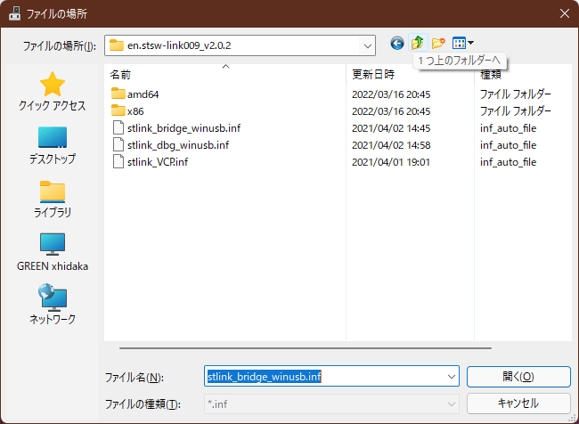](1f6de10c-36b2-4bc2-aa0b-9de47a3ac49e.png)  
（INF **ファイルの場所** 指定）

次の様に INF を含むのフォルダーの場所が確定したので **OK** をクリックして進みます。

[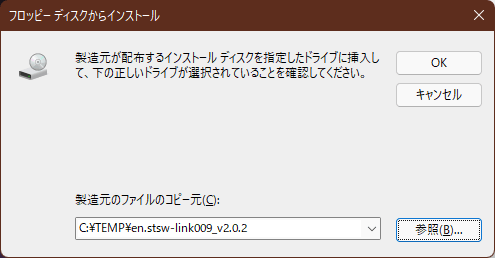](21b26487-290f-4ce5-9ca3-289f5a282d8e.png)  
（**フロッピーディスクからインストール** の古風なダイアログ、フォルダーの確認）

**インストールするデバイス名を確認**して **次へ** をクリックして進みます。

[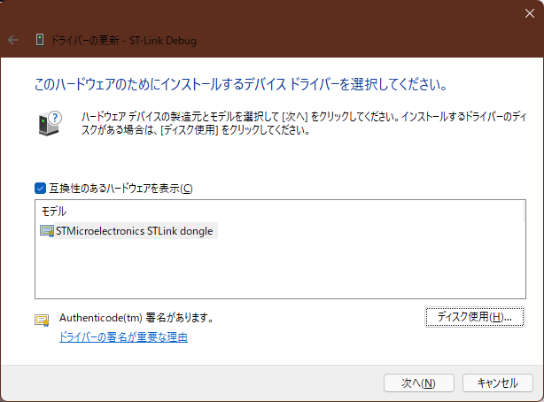](401c603d-8c9e-4174-8fab-74155dadcb64.png)  
（ドライバーの更新 ダイアログ ハードウェア名と署名を確認）

Windows セキュリティ の警告ダイアログが表示される場合があります。証明書の発行元を確認、**インストール** をクリックして進みます。

[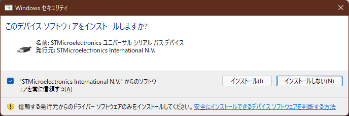](f2f6fb00-aa8d-4bbf-be6f-bc498c45f502.png)  
（Windows セキュリティ このデバイス ソフトウェアをインストールしますか？ **インストール** ボタン）

ドライバー更新完了のダイアログが表示されます。初期化処理が正常終了して、インストール完了したことを示します。

[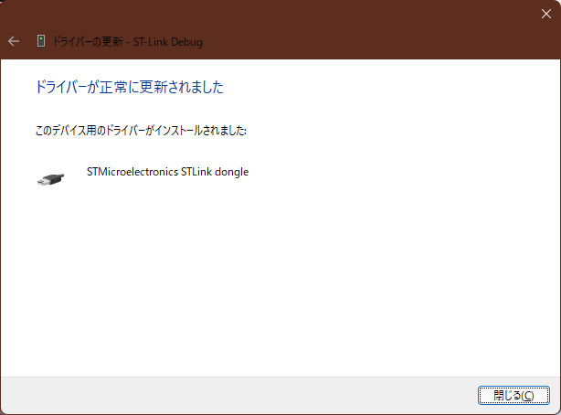](579347b8-6b05-4f88-b633-d705800dee95.png)  
（ドライバーの更新 正常に更新されました）

標準ドライバーの自動インストールと互換性問題

Windows 10では、多くの互換性があるドライバーをプレインストール（標準INFとドライバーストア）で用意する様になりました。これにより前述の「ドライバー無し」の黄色い三角マークが付くケースが減り、外部メディアでドライバーをインストールする機会も減りました。しかし各デバイスの性能を最大限に引き出すドライバー（最適なドライバー）が、常に自動インストールされるとは限りません。新しいハードウェアを装着した時の自動インストールがエラー無く終了するため、そのデバイスのインストールが正常に完了した様に見えますが、最適なドライバーではないため、実際はデバイス本来の機能や性能が発揮できないケース、不具合などが発生しています。

デバイスの識別は主にベンダーIDやプロダクトIDなどから成るハードウェアIDと互換性IDで行われます。デバイスも多様化し、様々なメーカーが様々な新しいデバイスを製品化するため、Windows は最適なドライバーを常に用意出来るとは言えません。デバイス供給メーカーが働きかけて、最適ドライバーのインストールを誘導するのは勿論ですが、利用者も目的に合った最適なドライバーのインストールを意識する必要があります。

もしデバイスを装着するか電源をONにしただけで意図せずに自動的にドライバーがインストールされた場合、インストールメディアを用意して、前述のドライバー未インストール状態からのインストール同じ手順で目的のドライバーをインストールすることが出来ます。

[参考リンク：ハードウェアID](https://docs.microsoft.com/ja-jp/windows-hardware/drivers/install/hardware-ids?WT.mc_id=WDIT-MVP-35878)

[参考リンク：互換性ID](https://docs.microsoft.com/ja-jp/windows-hardware/drivers/install/compatible-ids?WT.mc_id=WDIT-MVP-35878)

ドライバーファースト手順

このシナリオでは、デバイスを説明する前にドライバーパッケージをドライバーストアにコピーします。そのため利用する実デバイスが無くてもドライバーのインストールが出来ます。本当にドライバーのインストールが完了するのは、実際にデバイスを接続してドライバーの初期化が終わった時です。ドライバーファーストのシナリオによるドライバーパッケージの追加は、様々な方法で行われます。メーカーがデバイスとともに提供するインストールメディアやダウンロードパッケージのインストールで行われる場合があります。ここではWindows 11 の新しいデバイスマネージャーのアイコンを使う方法と、Windows 10等でも使えるPnPUtil のコマンドの方法を説明します。どちらもドライバーパッケージを確認して準備しておきます。

ドライバーの追加アイコン からのインストール

Windows 11では **デバイスマネージャー** のリボンメニューに、**ドライバーの追加** アイコンが出来ました。これを使って ドライバーファースト手順でインストールをします。**Windows 10 以前にはこのアイコンはありません。**次項で解説の PnPUtilコマンドを使用して下さい。

[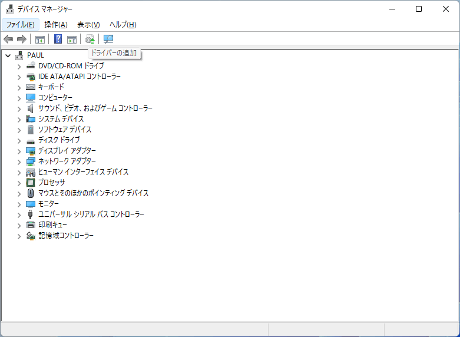](1fb09d14-73e1-4044-bc53-af610ae55ac3.png)  
（デバイスマネージャー **ドライバーの追加** アイコン をクリック）

ドライバーの追加ダイアログが起動します。前項と同様に **参照** をクリックしてドライバーパッケージのフォルダーの場所を指定して **次へ** をクリックします。

[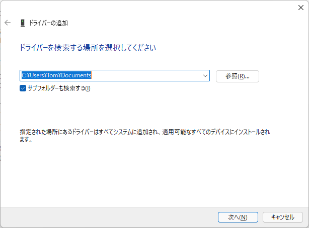](df61b2a3-def6-4c4b-909f-7f5b4a5e9596.png)  
（ドライバーの追加 ダイアログ）

Windows セキュリティ の警告ダイアログが表示される場合があります。証明書の発行元を確認、**インストール** をクリックして進みます。

[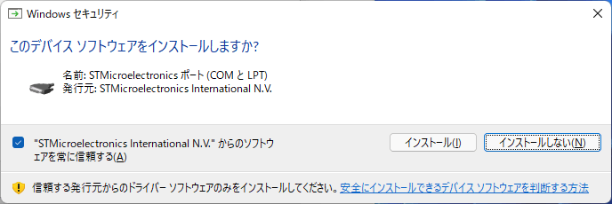](76555296-eb11-4576-9f82-17cc1c13d76d.png)  
（Windows セキュリティ このデバイス ソフトウェアをインストールしますか？）

デバイスファースト手順のインストールは直ぐに完了します。最後にインストールされた全 INF の状態が表示されます。

[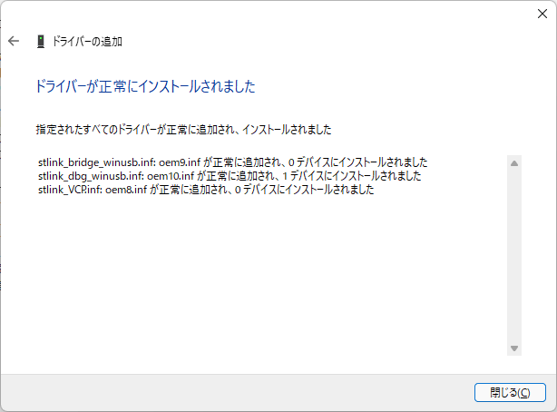](805d9e28-3d4d-433f-b350-59a2bc8246be.png)  
（ドライバーの追加 ドライバーが正常にインストールされました 表示）

PnPUtil コマンド

Windows 10などではコマンドプロンプトから、Windowsに含まれるPnPUtil コマンドでドライバーパッケージをドライバーファーストでインストール可能です。

> pnputil /add-driver NewDriver.inf

[参考リンク：PnPUtil のコマンド構文](https://docs.microsoft.com/ja-jp/windows-hardware/drivers/devtest/pnputil-command-syntax?WT.mc_id=WDIT-MVP-35878)

[https://docs.microsoft.com/ja-jp/windows-hardware/drivers/devtest/pnputil-command-syntax](https://docs.microsoft.com/ja-jp/windows-hardware/drivers/devtest/pnputil-command-syntax?WT.mc_id=WDIT-MVP-35878)

その他のドライバー

ファイルシステム ドライバー、オーディオ処理ドライバー、NDIS プロトコル ドライバーなど、その他の主にソフトウェア処理を行うドライバーは、それぞれのドライバーアーキテクチャのインストール手順に従います。ドライバー提供元ベンダーがインストールソフトウェアを用意するか、インストール手順を用意するので、その指示に従います。この様な専用ドライバーアーキテクチャのドライバーの多くは、INFを右クリックして表示される「インストール(I)」を指定してドライバーをインストールする場合があります。

TXTSETUP.OEM

C:ドライブで使うストレージデバイス用のドライバーなど、Windowsのインストール前に必要なドライバーをオフライン インストールする方法です。Windowインストールメディアに含まれないストレージコントローラボード用ドライバーのインストール手段として使われます。

[参考リンク：Txtsetup.oem ファイルWindows記述されたドライバーを Configuration Manager にインポートする方法](https://docs.microsoft.com/mem/configmgr/develop/osd/how-to-import-a-windows-driver-described-by-a-txtsetup-oem-file?WT.mc_id=WDIT-MVP-35878)

[https://docs.microsoft.com/mem/configmgr/develop/osd/how-to-import-a-windows-driver-described-by-a-txtsetup-oem-file](https://docs.microsoft.com/ja-jp/mem/configmgr/develop/osd/how-to-import-a-windows-driver-described-by-a-txtsetup-oem-file?WT.mc_id=WDIT-MVP-35878)
