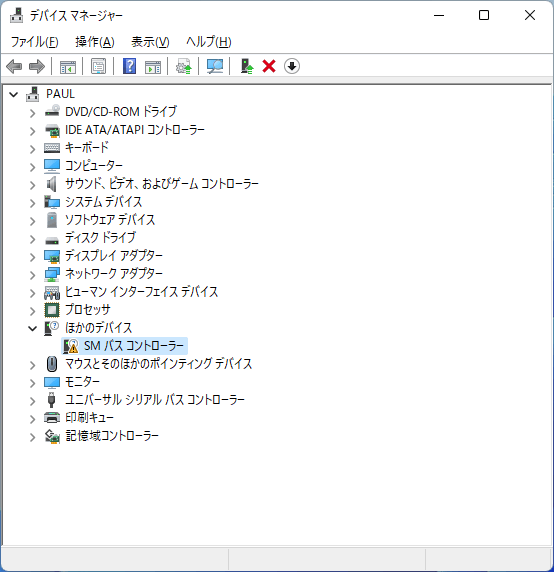
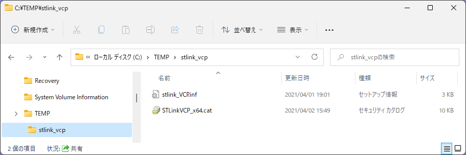
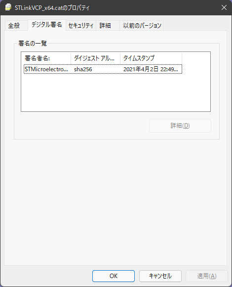
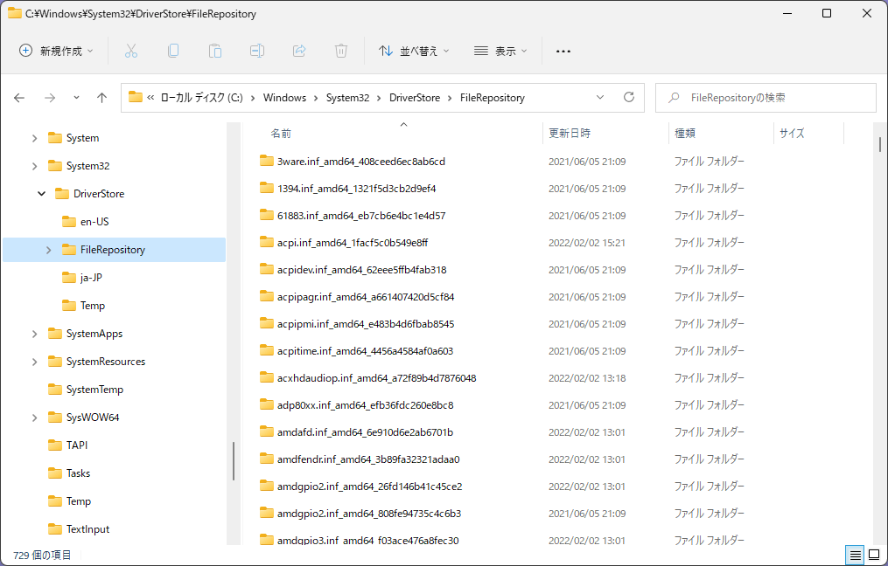

# ドライバーのインストールとは？

**テクニカル レベル** : 上級

**関連記事**

[デバイスマネージャーの起動](https://answers.microsoft.com/ja-jp/windows/forum/all/%E3%83%87%E3%83%90%E3%82%A4%E3%82%B9%E3%83%9E/981a79d0-cf25-460b-9b94-6426dfafca74)

**ドライバーのインストールとは？**

[ドライバー インストール方法](https://answers.microsoft.com/ja-jp/windows/forum/windows_11-hardware/%e3%83%89%e3%83%a9%e3%82%a4%e3%83%90%e3%83%bc/b6b95c1a-bd55-4ba3-878a-db0b36602f30)

[ドライバー更新と削除](https://answers.microsoft.com/ja-jp/windows/forum/windows_11-hardware/%e3%83%89%e3%83%a9%e3%82%a4%e3%83%90%e3%83%bc/8f602fc4-433f-4b5e-b948-178d0a51c11d)

[デバイスマネージャーと他のツール（上級編）](https://answers.microsoft.com/ja-jp/windows/forum/windows_11-hardware/%e3%83%87%e3%83%90%e3%82%a4%e3%82%b9%e3%83%9e/121166d7-ec27-49ad-a470-4473fcf8a703)

[ドライバーパッケージを探すには](https://answers.microsoft.com/ja-jp/windows/forum/windows_11-hardware/%e3%83%89%e3%83%a9%e3%82%a4%e3%83%90%e3%83%bc/b82904f7-d567-4fdc-9e2f-4239389eef93)  
  
デバイスに必要なドライバーがマシンにインストールされていない場合、デバイスドライバー（以降ドライバー）をインストールする必要があります。そのドライバーはどこから来て、どの様にインストールされるのでしょうか？理解にはまず、ドライバーのインストールが何かとドライバーのインストールを構成する要素を知る必要があります。

（ドライバーがインストールされていない状態）

ドライバーのインストールの正確な説明

Windowsドライバーのインストールは、アプリケーションプログラムとは少し異なり、正確には次の一連の動作を指します。

- INFとドライバーの動作に必要な全ファイルと署名、権限やアクセス権を確認
- 動作に必要なファイルを指定場所にコピーまたは存在確認
- ドライバープログラムを必要な権限で起動
- ドライバープログラムの初期化処理を完了

つまりドライバーのインストールとは、ドライバープログラムを起動して、一度以上初期化処理を完了したことです。ドライバーのインストールは、[プラグアンドプレイマネージャー](https://docs.microsoft.com/ja-jp/windows-hardware/drivers/install/pnp-manager?WT.mc_id=WDIT-MVP-35878)によって対象デバイスが接続されるか電源が入った時、それに最適なドライバーパッケージを検索し、起動してインストールを行います。

Windowsの動作に必要なドライバーは、Windows インストール時に他のWindowsカーネルモジュールとともに C:\Windows 以下に事前準備されます。一方でWindowsの動作状況や周辺デバイスの接続状態によって必要になるドライバーパッケージは、ドライバーストアに置かれます。

[ドライバーパッケージ](https://docs.microsoft.com/ja-jp/windows-hardware/drivers/install/driver-packages?WT.mc_id=WDIT-MVP-35878)

ドライバーのインストールに必要なINFとドライバーバイナリー(.SYS, DLL, ...) カタログファイルなどのファイルをまとめて、ドライバーパッケージと呼びます。ドライバーパッケージはインストールに必要なファイルを全てまとめたものです。

各種条件により、ドライバーバイナリーとセキュリティーカタログを省略することは可能ですが、INFは省略出来ません。ドライバーパッケージに含まれる全ファイル名はINFに記述します。[カタログ(.CAT)ファイル](https://docs.microsoft.com/ja-jp/windows-hardware/drivers/install/catalog-files?WT.mc_id=WDIT-MVP-35878)は、INFとINF記載のドライバーパッケージ全ファイルが作成時から改変されていないという正当性を示します。SHA256署名が必要です。すなわちINFを含めてドライバーパッケージに含まれる何かが変更されると、そのドライバーパッケージは署名が無効になり、ドライバーとして使えなくなります。

（シンプルなドライバーパッケージの例）

（CATファイルには SHA256署名が必須）

[ドライバーストア](https://docs.microsoft.com/ja-jp/windows-hardware/drivers/install/driver-store?WT.mc_id=WDIT-MVP-35878)

後述のプレインストールを含めた、そのマシンが使用する全ドライバーパッケージの保管場所です。**C:\Windows\System32\DriverStore** にあります。つまりこのディレクトリを全て保存（バックアップ）しておけば、トラブル発生時やディスク交換後などの再インストールなどで、以前のマシンと全く同じドライバー環境を再現することが出来ます。メーカー製Windows インストール済マシンの様に、独自ドライバーを持つマシンもこの場所に全てのドライバーパッケージがあります。

（ドライバーストア内 FileRepository フォルダーの内容例）

ディスクトラブルや誤操作等で、最初から入っていた固有ドライバーを削除した話を時々聞きますが、ドライバーストアがバックアップしてあれば復元出来ます。またドライバーストアは、同一デバイス用の異なるバージョンのドライバーを保管するため、削除しない限りは任意の古いドライバーパッケージを復旧できます。

一般に「ドライバーのインストール」と呼ばれるユーザーのメディアからのドライバーパッケージのコピー操作の多くは、実際はドライバーパッケージのドライバーストアへのコピー、即ちプレインストールです。ですが用語をわかり易くするため、以降の説明では、前述の正確なインストール動作も含めたプレインストール操作をまとめてインストールと呼びます。

Windows Updateでのインストール

Windows Update はプラグアンドプレイマネージャーにより対象マシンの全デバイス情報を調べて、最新または未インストールのドライバーがあるデバイス用のドライバーをダウンロードしてドライバーストアにコピーする機能があります。デバイスマネージャーでドライバーの検索時、「Windows Updateで更新されたドライバーを検索する」のオプションはこの動作を行います。

Windows Updateで検索できるようにするためには、デバイスやドライバーの製造元が該当ドライバーをWindows Updateに登録して、適用対象PC向けに公開している必要があります。従って Windows Update からは、特定の登録済ドライバーしかインストールできません。

インストールログファイル

ドライバーのインストールに関するログは全て、**C:\Windows\INF\setupapi.dev.log** に[SetupAPI テキスト ログ 形式](https://docs.microsoft.com/ja-jp/windows-hardware/drivers/install/setupapi-text-logs?WT.mc_id=WDIT-MVP-35878) で保管されます。
