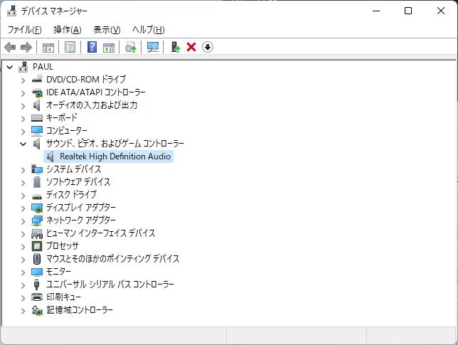
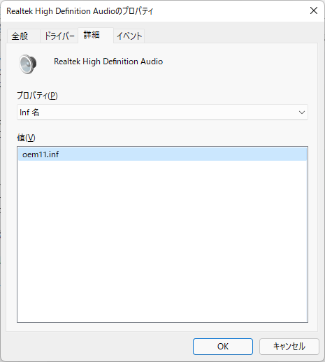
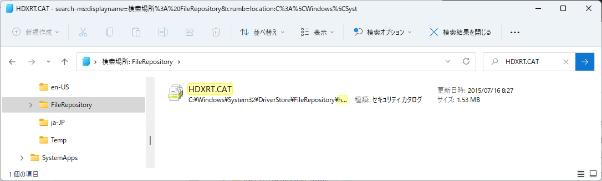
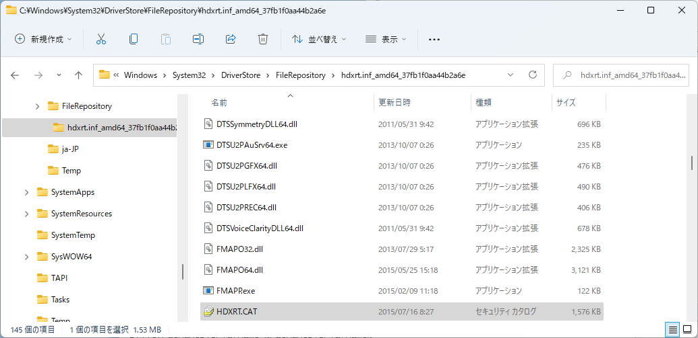

# ドライバーパッケージを探すには

**テクニカル レベル** : 上級

**関連記事**

[デバイスマネージャーの起動](https://answers.microsoft.com/ja-jp/windows/forum/all/%E3%83%87%E3%83%90%E3%82%A4%E3%82%B9%E3%83%9E/981a79d0-cf25-460b-9b94-6426dfafca74)

[ドライバーのインストールとは？](https://answers.microsoft.com/ja-jp/windows/forum/windows_11-hardware/%e3%83%89%e3%83%a9%e3%82%a4%e3%83%90%e3%83%bc/c4821319-3103-4bc3-b21d-dbf7da7e3363)

[ドライバー インストール方法](https://answers.microsoft.com/ja-jp/windows/forum/windows_11-hardware/%e3%83%89%e3%83%a9%e3%82%a4%e3%83%90%e3%83%bc/b6b95c1a-bd55-4ba3-878a-db0b36602f30)

[ドライバー更新と削除](https://answers.microsoft.com/ja-jp/windows/forum/windows_11-hardware/%e3%83%89%e3%83%a9%e3%82%a4%e3%83%90%e3%83%bc/8f602fc4-433f-4b5e-b948-178d0a51c11d)

[デバイスマネージャーと他のツール（上級編）](https://answers.microsoft.com/ja-jp/windows/forum/windows_11-hardware/%e3%83%87%e3%83%90%e3%82%a4%e3%82%b9%e3%83%9e/121166d7-ec27-49ad-a470-4473fcf8a703)

**ドライバーパッケージを探すには**

応用編として、Realtek オーディオドライバー（Realtek High Eefinition Audio）を例にして、インストールされて動作中の [ドライバーパッケージ](https://docs.microsoft.com/ja-jp/windows-hardware/drivers/install/components-of-a-driver-package?WT.mc_id=WDIT-MVP-35878) を探す方法を示します。[ドライバーストア](https://docs.microsoft.com/ja-jp/windows-hardware/drivers/install/driver-store?WT.mc_id=WDIT-MVP-35878) には、同種の似たような内容のドライバーパッケージ フォルダーが複数ある場合があります。各パッケージに含まれる INF はインストール時に OEM99.inf  の様なファイル名で C:\Windows\INF フォルダー以下にコピーされて動作します。[デバイスマネージャー](https://answers.microsoft.com/ja-jp/windows/forum/all/%E3%83%87%E3%83%90%E3%82%A4%E3%82%B9%E3%83%9E/981a79d0-cf25-460b-9b94-6426dfafca74) で動作中のデバイスノードの情報からこのドライバーパッケージを探すことにより、バックアップを保存したり、Windows 再インストールに復元したりすることができます。

まずデバイスマネージャーの サウンド、ビデオ、およびゲームコントローラー のドライバーノードの下の「Realtek High Eefinition Audio」ドライバーを右クリックして、プロパティの「詳細」タブを開きます。

  
（デバイスマネージャー **Realtek High Eefinition Audio** 表示）

以下の様に詳細タブで プロパティ値を「inf名」に設定して **inf名** を取得します。この例では、oem11.inf が求めるINFの名前です。

  
（デバイスマネージャー Realtek High Eefinition Audio デバイスの詳細タブ** Inf名** プロパティ 表示）

次に C:\Windows\INF フォルダーの oem11.inf ファイルをメモ帳などのエディターで開きます。

このファイルには次の様に重要な情報が記載されています。以下にこの例の oem11.inf ファイルでの記述を示します。

- CatalogFile（.CAT）カタログファイル名　**HDXRT.CAT**
- DriverVer ドライバーバージョン　**07/15/2015, 6.0.1.7560**
- DriverBinary ドライバーバイナリーファイル名　**RTKVHD64.sys**

（C:\Windows\INF フォルダーにあるINFファイルの内容表示例 oem11.inf）

これらの記述の中で、各ドライバーパッケージのほとんどが一つずつ持つのが拡張子 .CAT のカタログファイルです。従ってこのINFが持つカタログファイル名「HDXRT.CAT」ファイルをドライバーストア（C:\Windows\System32\DriverStore）で検索します。実際のドライバーパッケージは、C:\Windows\System32\DriverStore\FileRepository 以下に置かれるので、そこを検索しても同じ結果が得られます。

以下は「HDXRT.CAT」を検索した結果です。1件しかありませんでした。これが現在の「Realtek High Eefinition Audio」ドライバーのインストールで使用したドライバーパッケージに含まれるカタログファイルです。

  
（C:\Windows\System32\DriverStore\FileRepository 以下 HDXRT.CAT の検索結果）

検索結果の HDXRT.CAT ファイルを右クリックして、**ファイルの場所を開く** を実行することで、以下の様にドライバーパッケージのフォルダーの場所を開くことができます。

  
（検索結果から探したドライバーパッケージのフォルダー）
