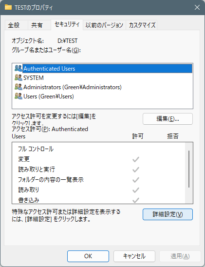
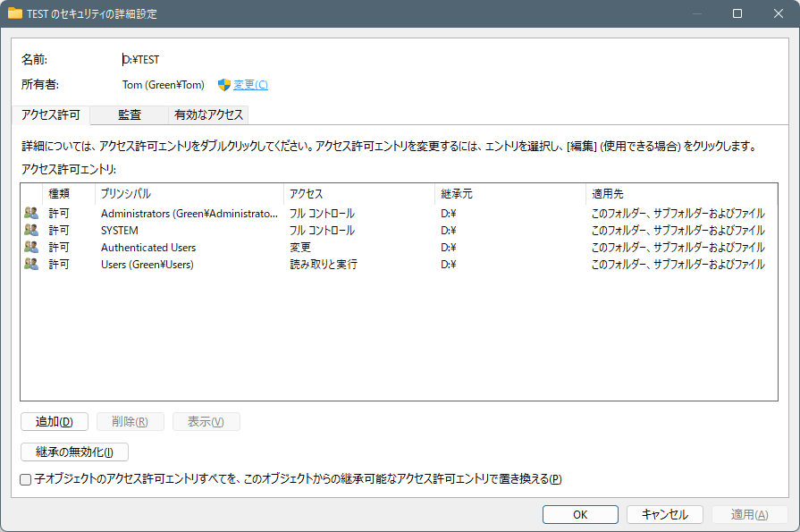
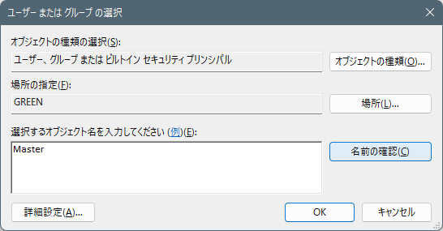
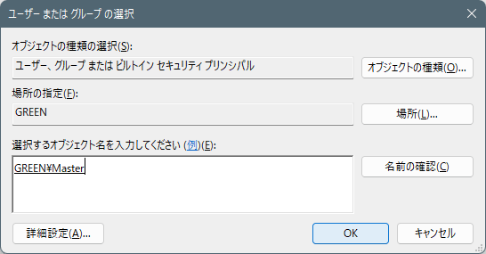
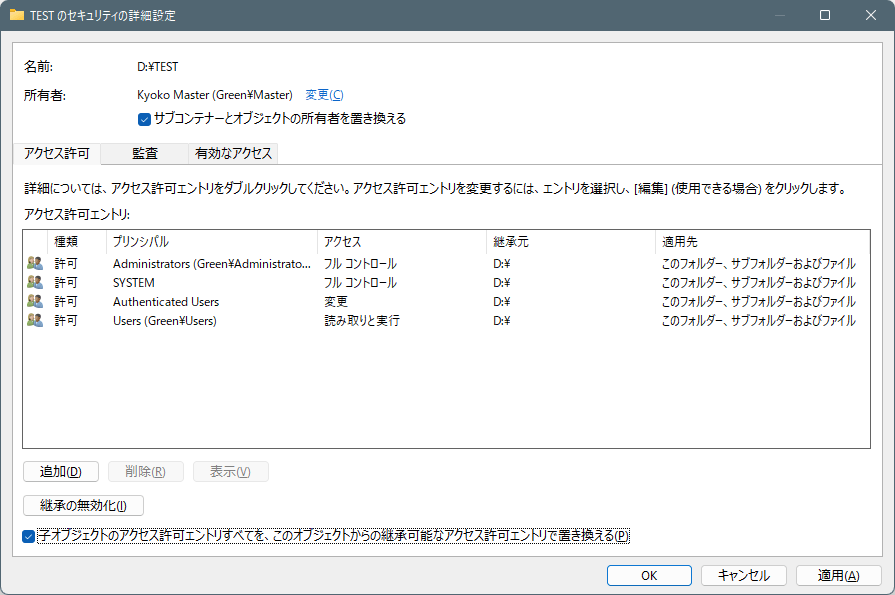

# フォルダーのアクセス権を一括設定して、自分が自由に使えるようにする方法

**テクニカル レベル** : 中級

**概要**

他のWindows PCに接続して動作していたディスクを取り外し、外付けディスクとしてそのまま再利用する場合などによく、「このフォルダーにアクセスする許可がありません」などの表示で、古い環境のファイルのアクセスが自由に出来ない場合があります。この記事ではWindows ファイル管理の最も重要で基本的な「所有者が全て」という考え方を理解して、実際に外付けドライブ内の特定のフォルダーのアクセス権を設定することで、ファイルやフォルダーなどのデータを、余計な手間をかけずに読み書き出来る様にする方法を示します。

**ポイント**

ポイントは次の3つです。

１．所有者をAdministratorsなどのグループではなく、**Administrators権限のあるユーザーでログインして操作し**、その自分に設定します。

２．詳細設定を開いて、その**自分のユーザー名を手入力して確認させる**。

３．**サブコンテナーとオブジェクトの所有者を置き換える**

**手順**

まず置き換えたいフォルダーのプロパティのセキュリティ タブを開きます。

詳細設定をクリック後、所有者の変更を開きます。この例では、TomからMasterに変更します。

ユーザーまたはグループの選択 のダイアログでは選択するオブジェクトの入力で、変更後のユーザー名（グループ名は不可）を手入力後、名前の確認をクリックします。

以下の様に勝手にマシン名（この場合はGREEN）が付加されるので、確認してOKをクリック。

**サブコンテナーとオブジェクトの所有者を置き換える** にチェックを入れて、なおかつ「子オブジェクトのアクセス許可エントリすべてを、このオブジェクトからの継承可能なアクセス許可エントリで置き換える」にもチェック入れて、OK、OKで完了。

注意）

この所有者を入れ替えてアクセス設定する方法では、操作対象ディスクを元の環境に戻して動作させることが２度と出来なくなります。ご注意ください。
