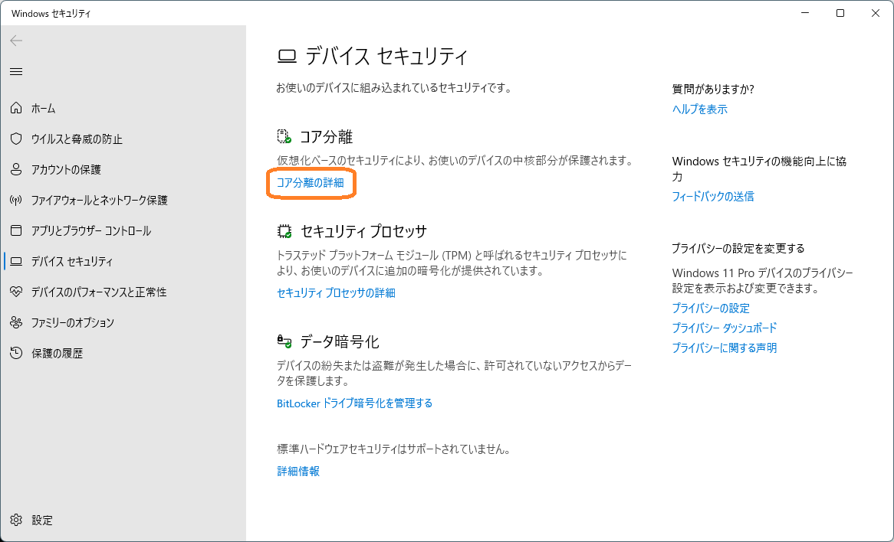
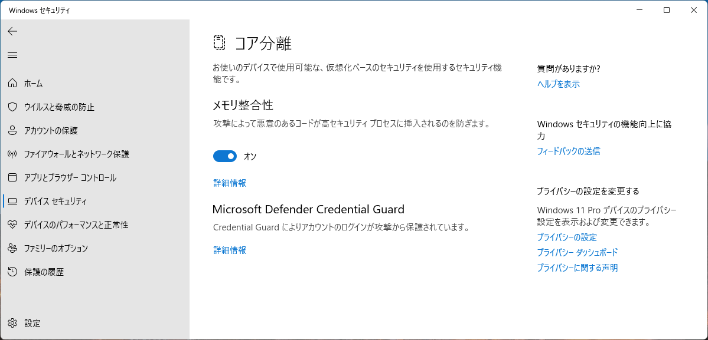
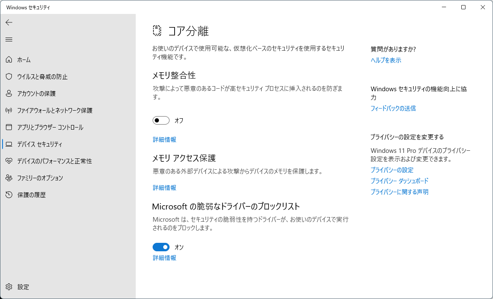

# メモリ整合性やコア分離はなぜ必要か？

**テクニカル レベル** : 中級

**概要**

最近目にする機会が増えた、メモリ整合性やコア分離といったWindows 11 のセキュリティ機能とその設定について解説します。なお、以前書いた記事の内容が間違っていたため、大幅に修正して再掲載しています。

まず、Microsoft 公開の主要な参考文献を以下に示します。

- [**リモートワークコラム：**](https://www.microsoft.com/ja-jp/biz/smb/column.aspx)[**Windows 11 は飛躍的にセキュリティを強化**](https://www.microsoft.com/ja-jp/biz/smb/column-enhanced-security-for-windows-11.aspx)
- [**サポート：コア分離**](https://support.microsoft.com/ja-jp/windows/%E3%82%B3%E3%82%A2%E5%88%86%E9%9B%A2-e30ed737-17d8-42f3-a2a9-87521df09b78)
- [**サポート：Windows セキュリティでのデバイス保護**](https://support.microsoft.com/ja-jp/windows/windows-%E3%82%BB%E3%82%AD%E3%83%A5%E3%83%AA%E3%83%86%E3%82%A3%E3%81%A7%E3%81%AE%E3%83%87%E3%83%90%E3%82%A4%E3%82%B9%E4%BF%9D%E8%AD%B7-afa11526-de57-b1c5-599f-3a4c6a61c5e2)

最初の「Windows 11 は飛躍的にセキュリティを強化」資料では、Windows 11が新世代のハードウェア機能を使用して、大幅にセキュリティを向上させていることがわかります。これらと関連情報を独自に、なるべく分かり易く補完しながら解説してみます。

ポイント

Windows 11のメモリ整合性やコア分離の機能について、「これを読む人が恐らく知りたいこと」を、少し誇張した表現で簡単に伝えると、次の通りになります。

1. コア分離のメモリ整合性セキュリティ機能の目的は、ハードウェア仮想化による究極のセキュリティ機能の実現です。
2. この機能を有効化しなかった場合に発生する、差し迫った脅威や脆弱性は、今のところは公開されていません。
3. コア分離のメモリ整合性を有効化しない場合、直ぐに何らかのマルウェアに侵入されることは今のところはありません。
4. ハードウェアとソフトウェアの技術進化により、これらの新世代のハードウェアサポートによるセキュリティ機能が利用出来る様になりました。
5. 従って対応可能なハードウェアやドライバー（ソフトウェア）を持っている場合、有効化する事が推奨されます。

分かり易い表現で言うと、転ばぬ先の「最新エレクトロニクス」の杖とでもいう感じでしょうか。現時点ではまだ他の市販OSではほとんど実装されていない、高機能なセキュリティ機能が搭載されているという事になります。

デメリット

1. 現在はまだ、全ての市販PCや周辺機器、ドライバーが対応していないため、利用する環境やデバイスによっては有効に出来ません。
2. コア分離のメモリ整合性を有効にする事で、僅かですが、システム全体の処理性能が下がります。

デメリットについて補足すると、ドライバー対応の問題は、後述の「Microsoftの脆弱なドライバーのブロックリスト」などとも関係するため、今後各ベンダーとも協力して改善され、いずれは全てのデバイスが対応する見通しです。なお性能劣化は僅かであるのと、利用者が有効・無効を制御出来るため、処理性能が問題となる用途でだけ、無効化して運用することも可能す。

詳細説明

「**コア分離**」ダッシュボードの各項目に基づいて説明します。「**コア分離**」ダッシュボードは、設定メニューの **プライバシーとセキュリティ** → **Windows セキュリティ** → **デバイスセキュリティ **と選択し、以下の「Windows セキュリティ」パネルの** デバイス セキュリティ** ダッシュボードで、**コア分離の詳細** をクリックして表示します。

この「**コア分離**」ダッシュボードは後述の様に、実行環境ハードウェアデバイスの状況によって、**表示内容や設定項目が異なる場合がある**ので、十分に注意してください。現在確認している中では今のところ、一番設定が多い場合は次のメニューが表示されます。これらの設定メニューのうち、ハードウェア仮想化によるコア分離技術に依存する設定項目は、実質的にはメモリ整合性だけです。したがってこの「コア分離」のダッシュボード名や構成は今後、変わる可能性があります。

- **メモリ整合性**
- **メモリアクセス保護**
- **ローカルセキュリティ機関の保護**
- **Microsoft Defender Credential Guard**
- **Microsoftの脆弱なドライバーのブロックリスト**

メモリ整合性

メモリ整合性はWindows 10にも導入済の、ハードウェア仮想化技術に基づいてドライバーコードの実行を分離する、画期的なセキュリティ機能です。

マルウェアの侵入や誤動作が起きる可能性があるカーネルモジュールとして、ドライバーソフトウェアがありますが、隔離した仮想ハードウェア環境でこのコードを実行する際に事前検証することで、被害を事前に防ぐ仕組みです。CPUのハイパーバイザー管理下で迅速に動作するため、システムのスループットへの影響が少ないのが特長です。従って実行するドライバーコードが対応している必要があります。

メモリアクセス保護

メモリ整合性が近未来にも広範囲に有効なセキュリティ機構を目指しているのに対して、これは過去に制定された「DMAメモリ再マップ」という、ハードウェア動作仕様の穴を防ぐための保護機能です。詳細は「[カーネルDMA保護の有効化について](https://answers.microsoft.com/ja-jp/windows/forum/all/%E3%82%AB%E3%83%BC%E3%83%8D%E3%83%ABdma%E4%BF%9D/d601eaeb-0f0f-492c-99b5-5cb8856432a6)」の回答に記していますが、現時点で懸念されるのは実質Thunderbolt 3 対応の USB-C 通信ケーブルの悪用だけという、ピンポイントの対応です。USB Type-Cホストコントローラーとそれを搭載するハードウェアの製造ベンダーはほぼ、マザーボードベンダーだけという事情もあり、対応はTPM 2.0機能の実装と同様にベンダー任せとなっている様子です。

参考ページ）

- [LEARN カーネル DMA 保護](https://learn.microsoft.com/ja-jp/windows/security/information-protection/kernel-dma-protection-for-thunderbolt?WT.mc_id=WDIT-MVP-35878)

ローカルセキュリティ機関の保護

未署名などの未確認なプロセスが、パスワードを初めとする、ローカルとリモートのユーザーのセキュリティ情報にアクセスするのを防止します。分かり難い表現ですが、Windows 11では、ローカルセキュリティ機関、Local Security Authority (LSA)と呼ぶソフトウェア機構を、セキュアブートとUEFIロック保護機構によって保護することで実現されます。この機能は、自動有効化の要件に従って自動的に有効化されます。

参考ページ）

- [追加の LSA の保護の構成](https://learn.microsoft.com/ja-jp/windows-server/security/credentials-protection-and-management/configuring-additional-lsa-protection?WT.mc_id=WDIT-MVP-35878)

Microsoft Defender Credential Guard

パスワード等のクレデンシャル情報を管理する、仮想化ベースのセキュリティ機構。従来のLSA（ローカル セキュリティ 機関）とは分離して、ハイパーバイザー上に仮想化して、有効化状態を変更できます。

参考ページ）

- [Windows Defender Credential Guard の管理](https://learn.microsoft.com/ja-jp/windows/security/identity-protection/credential-guard/credential-guard-manage?WT.mc_id=WDIT-MVP-35878)
- [Windows Defender Credential Guard のしくみ](https://learn.microsoft.com/ja-jp/windows/security/identity-protection/credential-guard/credential-guard-how-it-works?WT.mc_id=WDIT-MVP-35878)

Microsoftの脆弱なドライバーのブロックリスト

ドライバー提供ベンダーとセキュリティベンダーが協力して提供する、脆弱性があるかまたは悪意のあるドライバーに関する情報、すなわちブラックリスト方式でドライバー実行を制御（ブロック）する設定です。この機能は、 アプリケーション制御機能と同様に、Windows Defender の機能として実装されています。

参考ページ）

- [Microsoft が推奨するドライバー ブロックの規則](https://learn.microsoft.com/ja-jp/windows/security/threat-protection/windows-defender-application-control/microsoft-recommended-driver-block-rules)

コア分離ダッシュボード 表示例

