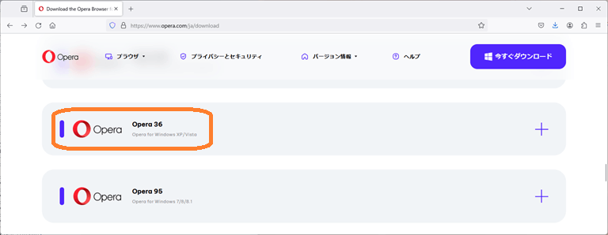
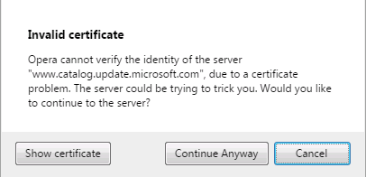
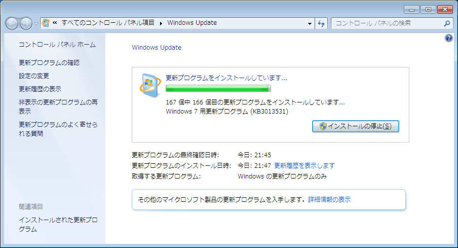

# 今どきの Windows 7 の Windows Update

サポートが終了している Windows 7 ですが、今でも時々問い合わせを受けます。過去に[私が投稿した質問の補足](https://answers.microsoft.com/ja-jp/windows/forum/all/windows-7%e7%94%a8-windows/96374288-ea8a-4bfa-aaf7-03351baa11d6?page=2)がヒントになるので必要な都度に紹介していましたが、重要な Windows 7 の Windows Updade 方法の部分が容易に表示されず、見難いので今回、抜き出して別記事にしました。この手順では、Windows 7 SP1で SHA-2(sha256) 署名のドライバーがインストール出来る様になるため、現在使用している Windows 7 マシンにWindows 8以降用の新しいハードウェアやドライバーを追加することも可能になります。

この手順に従っても、**Windows 7 のサポートが切れている事実は何も変わらないので、試す方は自己責任で、くれぐれもセキュリティに配慮してのご利用をお願いします。**

新規インストール やWindows Updateが動作しない Windows 7 を使えるようにする手順

事前準備

新規インストール直後の Windows 7 と SP1 環境では、ブラウザが標準IEや最近のものだと全く使えません。試行錯誤の結果、[**Opera の Download サイト**](https://www.opera.com/ja/download) からダウンロード入手できる、Opera 36 (XP/Vista) 用を使ってうまくいくことを確認しています。これを最初に、更新対象の Windows 7 PCとは別のマシンでダウンロードし、その exe ファイルをコピー、起動して、更新対象マシンにインストールしておきます。

次に更新対象の Windows 7 マシンが SP1 未適用の場合は、先に前述の Operaを起動して下記サイトからダウンロード、インストールして、SP1に更新しておきます。以降も同じですが、入手する **マシン・アーキテクチャに十分に注意します。**

また、Operaを起動しての操作は最初のうち、次の様な「証明書が無い」などの警告が多数出ますが、全て無視して操作を続けます。

[https://www.catalog.update.microsoft.com/Search.aspx?q=KB976932](https://www.catalog.update.microsoft.com/Search.aspx?q=KB976932)

SP1環境（適用済）の場合は当然、この SP1 のインストールは不要です。

手順１

[KB4474419](https://www.catalog.update.microsoft.com/search.aspx?q=KB4474419) と [KB4490628](https://www.catalog.update.microsoft.com/search.aspx?q=KB4490628) を入れます。順不同です。インストール後は再起動しておきます。

この二つで SHA-2 証明書が入るので、リモートデスクトップが使える様になり、またSHA-2 証明書が必要な Visual Studio 等のプログラムがインストール出来る様になり、WIndows 8以降用のドライバーもインストール可能になります。   しかし Windows Update の実行はエラーとなります。

手順２

この後、 [KB4536952](https://www.catalog.update.microsoft.com/search.aspx?q=KB4536952) を入れます。

手順３

最後に [KB4534310](https://www.catalog.update.microsoft.com/search.aspx?q=KB4534310) を入れ、完了したら再起動します。再起動後、**Windows  7 のサポートが切れていますというメッセージが出ますが、これはここまでの手順がうまく行っているという合図です。**

Windows 7 用の Windows Update が2021年6月末に発生した問題の様に止まっていなければ、これで Windows 7 SP1 新規インストールマシンで次に示すように、Windows Update が完璧に利用出来る様になります。

Windows Update 後の再起動が終わると、今度は最新版の Microsoft Edge がお出迎えするので、少し感動です。

この件、追記：たまたま元のWindows 7.1 が中途半端なWindows Update 状態だったからかも知れませんが、2024年6月の動作確認時は、Windows Update での Microsoft Edge 自動インストールはありませんでした。IEを起動して Microsoft Edge のインストーラをダウンロードして自力インストールする必要がありました。Microsoft Edge では最新の（？）Copilot が利用可能です。

追記：TLS1.1 / 1.2 優先順位設定

[**ウインドウズ7から10に移行したPC　リカバリーしました　10に戻したいのですがうまく行きません**](https://answers.microsoft.com/ja-jp/windows/forum/all/%e3%82%a6%e3%82%a4%e3%83%b3%e3%83%89%e3%82%a6/8b033d99-56b7-4f18-9319-135656f79fa1)

[https://answers.microsoft.com/ja-jp/windows/forum/all/%e3%82%a6%e3%82%a4%e3%83%b3%e3%83%89%e3%82%a6/8b033d99-56b7-4f18-9319-135656f79fa1](https://answers.microsoft.com/ja-jp/windows/forum/all/%e3%82%a6%e3%82%a4%e3%83%b3%e3%83%89%e3%82%a6/8b033d99-56b7-4f18-9319-135656f79fa1)

の回答検証中に、この手順で更新した Windows 7 SP1では、MediaCreationTool22H2.exe を実行すると「エラーコード: 0x80072F8F - 0x20000」のエラーが出ることを確認したので、追加修正します。この件も [Hebikuzure](https://answers.microsoft.com/ja-jp/profile/24d2195a-069d-4689-9864-d2ae58c6c046) さんの指摘です。ありがとうございます。

このエラーの原因はトランスポート層セキュリティ (TLS 1.1/TLS 1.2) の優先順位設定でした。詳細は、[**Windows の WinHTTP で TLS 1.1 および TLS 1.2 を既定のセキュリティ で保護されたプロトコルとして有効にするための更新プログラム**](https://support.microsoft.com/ja-jp/topic/windows-%E3%81%AE-winhttp-%E3%81%A7-tls-1-1-%E3%81%8A%E3%82%88%E3%81%B3-tls-1-2-%E3%82%92%E6%97%A2%E5%AE%9A%E3%81%AE%E3%82%BB%E3%82%AD%E3%83%A5%E3%83%AA%E3%83%86%E3%82%A3-%E3%81%A7%E4%BF%9D%E8%AD%B7%E3%81%95%E3%82%8C%E3%81%9F%E3%83%97%E3%83%AD%E3%83%88%E3%82%B3%E3%83%AB%E3%81%A8%E3%81%97%E3%81%A6%E6%9C%89%E5%8A%B9%E3%81%AB%E3%81%99%E3%82%8B%E3%81%9F%E3%82%81%E3%81%AE%E6%9B%B4%E6%96%B0%E3%83%97%E3%83%AD%E3%82%B0%E3%83%A9%E3%83%A0-c4bd73d2-31d7-761e-0178-11268bb10392) に記載されています。

確認すると記事記載の [KB3140245](https://catalog.update.microsoft.com/search.aspx?q=kb3140245) 自体は Windows Update の品質ロールアップで導入済でした。しかしレジストリ設定によるプロトコル優先順位の設定がされていなかったため、これを設定して MediaCreationTool22H2.exe などを実行してもエラーが出ない様にします。

手順は前記記事のリンク先「Easy Fix DefaultSecureProtocols レジストリ サブキーを自動的に追加するには、ここをクリック します。... 」に従います。以下からMicrosoftEasyFix51044.msi を入手して実行するだけです。

[https://download.microsoft.com/download/0/6/5/0658B1A7-6D2E-474F-BC2C-D69E5B9E9A68/MicrosoftEasyFix51044.msi](https://download.microsoft.com/download/0/6/5/0658B1A7-6D2E-474F-BC2C-D69E5B9E9A68/MicrosoftEasyFix51044.msi)

（2024年6月30日 更新）
