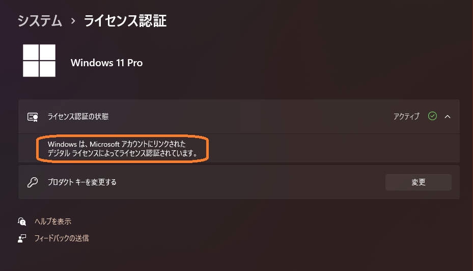

# 自作ユーザーのためのデジタルライセンス保守方法

以前、[ここの回答](https://answers.microsoft.com/ja-jp/windows/forum/all/%E3%82%A2%E3%82%AF%E3%83%86%E3%82%A3%E3%83%99/42b09e7d-9081-466b-b49b-8d87b30775db)で書いたときから時間がたちましたが、あまり知られていないと思われる、自作ユーザーのための部品交換時のデジタルライセンス保守方法について、記事を書きます。あくまでも自己流の体験に基づくだけの事なので、これでうまく行くことは保障しません。ただしこの方法を確実に実行するようにしてからは、自分ではPC組み換え時にライセンスを無効にすることが無くなりました。大前提として、使用するライセンスはリテール版（パッケージ版）に限ります。DSP版やOEM版などは使用したことが無いので、何が起こるかわかりません。この記事の対象外です。

目的

部品交換時に電話認証は対応時間が限られているし、マイクロソフトのオペレーターに迷惑をかけるのは面倒なので、できるだけ自動認証されるようにしたいいかに取得済のデジタルライセンスを維持するかという事だけです。昔の自分の様に、不注意でライセンスを電話認証が必要な状態に無効にしてしまう事を避けるためです。典型的な事例として、（CPU付）マザーボード交換と（新規インストールする）ディスク交換を取り上げます。他の部品交換でもライセンスを失う可能性はありますが、それはこの２つの例を参考にして、各自で良く考えて作業して下さい。なおこの方法で正常にライセンスを維持し続ける限りは、何回でも部品交換が可能です。

事前準備

全てのケースでデジタルライセンスが正しく認証されて、（ライセンス認証の命綱の）Microsoftアカウントに紐付け（リンク）されていることを入念に確認します。以降解説の手順では、認証前に部品の取り付けや取り外しをする場合があるため、マザーボード交換直前の部品構成状態で確認します。

Windows 10では 設定→更新とセキュリティ→**ライセンス認証** で、**Microsoft アカウントにリンクされた ライセンス認証**となっている事を確認します。

Windows 11では、設定→システム→ライセンス認証 で、**ライセンス認証の状態** を開いて **Microsoft アカウントにリンクされた ライセンス認証**となっている事を確認します。

以下はMicrosoft アカウント に**紐付けリンクされてない**、組み換えでライセンスが無くなる危ない例です。

以下は Microsoftアカウントにログインした時の、登録済デバイスの表示例です。3台目以上は、すべてのデバイスの表示をクリックすると確認できます。

**すべてのデバイスの表示**例です。拡張表示で詳細情報を確認できます。

重要なことはこの命綱の Microsoftアカウント登録済デバイスの内容が、なぜか時々変わってしまい、登録したデバイス名が消えてしまう等といった、当てにならない場合があることです。マシン情報が化けた事もあります。Windows 10 の21H1の様なリリースバージョン番号の更新時やWindows 11へのアップデート時も、登録バージョン番号反映されない場合があります。情報が間違っているとき、あるいは目的のマシンが登録されてない場合は、このMicrosoftアカウントでの表示マシン名を削除して、PC側で必ずWindowsへのログイン設定をやり直して更新します。この様な手順は、PC構成の入れ替時に必須です。納得いくまで何回も再起動、ログインし直しを入念にして正しく登録してあることを確認します。

マザーボード交換

マザーボード交換による再認証のコツは、交換対象のマザーボードとCPU以外の部品を極力流用することです。とは言ってもオンボードにほとんどのデバイスが載っている現在では、最低でも C:ドライブのディスクとDVDドライブを流用することで「マザーボードとCPUが交換されたが同じマシンだ」と思わせる様に努力します。可能であれば再認証時だけでも、ビデオカードも流用した方がいいでしょう。Windowsがライセンス継続利用を許容する部品の変更範囲は明らかではありませんが、Windows XPの頃はリテール版でのライセンス流用可能なPC変更識別の条件としてCPU、Diskドライブ、MACアドレスとともにDVD/CDドライブという条件がありました。それで今でも迷信の様に、このDVDドライブ条件を積極的に「同じマシンですよ」と利用します。マザーボード交換の際のC:ディスクドライブの継続使用は必須です。場合によっては、再認証前の新規インストール（詳細手順は後述）も考えます。重要なことは、以前使っていた環境と同じであるというハードウェアや周辺機器のヒントが一つもない、つまり**全く新しい環境ではどうやっても再認証されない**という事です。

[質問の回答](https://answers.microsoft.com/ja-jp/windows/forum/all/%E3%82%A2%E3%82%AF%E3%83%86%E3%82%A3%E3%83%99/42b09e7d-9081-466b-b49b-8d87b30775db)に書いた通り、この方法で3台のPCを組み換えましたが、いずれも再認証出来ました。

補足として大事なことは、再認証時には、結構なトラブルがあるので、ライセンスサーバーが停止している旨のメッセージが出る場合には、ネットワーク周りの設定を良く確認する等して何回も再挑戦します。なぜか、翌日になって認証される場合もあります。なお組み換え後初めての電源投入ですんなりと認証されない場合は、ライセンス認証のトラブルシューティングから入って、表示される「このデバイス上のハードウェアを最近変更しました」をクリックして進みます。

ディスク交換

最近ありがちな、ディスクドライブ機種交換と Windows 新規インストールを同時に行った場合の再認証事例です。次の手順でした。

１．交換対象ディスクドライブ以外は全て同一構成（同一マシン）とします。

２．マシン名、WORKGROUP、アカウント名、当然Microsoftアカウント名を以前のマシンと同じにします。

２．新規インストールの再認証用ディスクのOSレビジョン、リリースバージョン、Windows Update は再認証前と同じにします。

３．未認証の新ディスク（新規インストール Windows）で立ち上げて再認証のためのトラブルシューティング実行時、最初は全く登録済デバイスが認識されず拒否され、ライセンスを購入せよとの警告が出ます。

４．少し待ち、IPアドレス、プロキシ等のネットワークの設定の変更、Microsoft アカウントでのログインし直し、登録状況のWebで登録内容の確認、ローカルアカウントとの行き来等をしてみます。

５．トラブルシューティングを何回かクリックしていると、やがて「ライセンス認証をする」趣旨のリンクが現れるので、それをクリックします。そこで「ライセンス認証が完了しました」の表示が出ます。マシン名を当然合わせているため、CPU マザーボード交換時の様に、このマシンですか？みたいなマシン名の確認はありません。これで再認証完了です。推測ですが、Windows本体が入れ替わった際のデジタルライセンス再認証には、数十分程度の時間がかかるようです。

以上、あくまでも自己経験による事例紹介でした。繰り返しですが、動作保証はしません。リテール版以外は対象外です。

（皆様、コメントありがとうございました。3月27日修正しました。）
